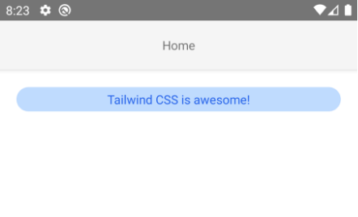
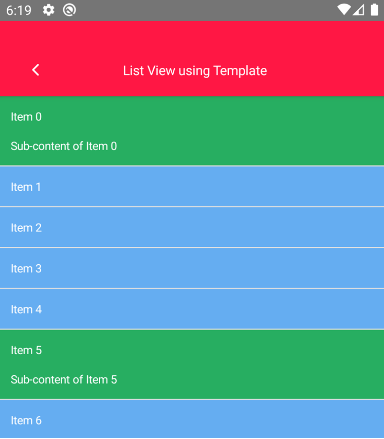
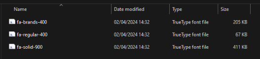
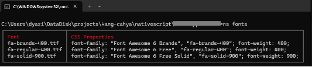
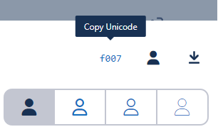
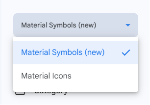
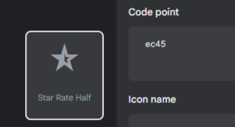
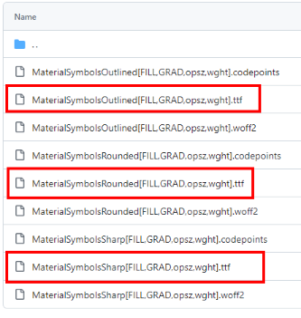
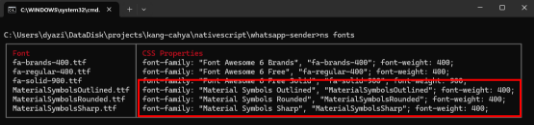

| Versi | Ditulis Pada | Penulis |
|-------|----|-----|
| 1.0 | *Juni 2024* sampai *Agustus 2024* | [Kang Cahya](https://github.com/dyazincahya) |

# BAB VII : KONSEP TINGKAT LANJUT


**7.1 Kode Native**

Nativescript memungkinkan Anda menulis sebuah Kode Native dan kemudian memanggilnya di dalam kode Javascript secara langsung, hal ini sudah saya colek sedari BAB I. Di sana Anda akan menemukan contoh Kode Native untuk membuat sebuah Toast.

Anda dapat menuliskan Kode Native di Javascript-Nya secara langsung atau Anda juga dapat membuat sebuah file terpisah, lalu menuliskan Kode Native di dalam file tersebut, dan kemudian Anda memanggil file-Nya dari Javascript. Untuk penulisan Kode Native di file terpisah, Anda dapat memberi ekstensi file tersebut berdasarkan Kode Native yang Anda akan tulis. Jika Anda akan menulis Kode Native dengan bahasa Kotlin simpan file-Nya dengan ekstensi (.kt), begitu pun untuk bahasa yang lainnya.

Untuk Kode Native dengan file terpisah, Anda dapat menyimpan file-Nya di :

- *App\_Resources/iOS/src* (untuk IOS). Anda dapat menyimpan file dari bahasa native IOS di sana, mau itu Objective-C atau Swift.
- *App\_Resources/Android/src/main/java* (untuk Android). Anda dapat menyimpan file dari bahasa native Android di sana, mau itu Java atau Koltin.

Anda dapat memanfaatkan perintah dari Nativescript untuk men-generate file native-Nya, jadi Anda tidak perlu membuat file-Nya secara manual.

*Perintah Nativescript untuk men-generate file native hanya tersedia di Nativescript versi 8.8 atau versi lebih baru. Di bawah versi 8.8 Anda harus membuat file-Nya secara manual.*

Perintah untuk membuat file Swift (IOS)

```bash
ns native add swift AwesomeClass

# Lokasi file: 
# App_Resources/iOS/src/AwesomeClass.swift
```

Perintah untuk membuat file Objecttive-c (IOS)

```bash
ns native add objective-c AwesomeClass

# Lokasi file: 
# App_Resources/iOS/src/AwesomeClass.h
# App_Resources/iOS/src/AwesomeClass.m
```

Perintah untuk membuat file Kotlin (Android)

```bash
ns native add kotlin com.kangcahya.AwesomeClass

# Lokasi file: 
# App_Resources/Android/src/main/java/com/kangcahya/AwesomeClass.kt
```

Perintah untuk membuat file Java (Android)

```bash
ns native add java com.kangcahya.AwesomeClass

# Lokasi file: 
# App_Resources/Android/src/main/java/com/kangcahya/AwesomeClass.java
```

Sebagai contoh, kita akan mencoba membuat kasus sederhana. Untuk kasusnya kita akan membuat sebuah Helper Toast menggunakan bahasa native Kotlin, kemudian Helper Toast tersebut kita akan coba panggil di Javascript. Lalu kita akan membuat sebuah tombol sebagai Trigger-Nya. Jadi Toast akan muncul di aplikasi saat tombol di tekan. Berikut adalah langkah-langkah Nya.

1. Jalankan perintah berikut untuk men-generate file Kotlin

```bash
ns native add kotlin com.kangcahya.ToastHelper
```

2. Tambahkan kode berikut pada file Kotlin-Nya

```kotlin
package com.kangcahya

import android.content.Context
import android.widget.Toast

class ToastHelper {
    companion object {
        @JvmStatic
        fun showToast(context: Context, message: String) {
            Toast.makeText(context, message, Toast.LENGTH_LONG).show()
        }
    }
}
```

3. Pada file Javascript, tambahkan kode berikut, yang berfungsi untuk memanggil Method *showToast* yang ada di file Kotlin.

```javascript
import { Application } from "@nativescript/core";

// memanggil file Kotlin
const ToastHelper = com.kangcahya.ToastHelper;

export function showToast() {
  // pesan yang akan ditampilkan
  const message = "Hello, this Toast from Kotlin in NativeScript";

  // mendapatkan Application Context dengan bahasa Java
  const applicationContext =
    Application.android.foregroundActivity || Application.android.startActivity;

  // memanggil Method Toast yang ada di file Kotlin
  ToastHelper.showToast(applicationContext, message);
}
```

4. Pada file XML, buat satu tombol lalu tambahkan gestur Tap *(tap=”showToast”)*. Sehingga saat tombol di tekan maka Toast akan muncul.

```xml
<Button text="Show Toast Android from Kotlin" tap="showToast" />
```

**7.2 Styling**

Pada NativeScript 8, banyak fitur baru telah ditambahkan untuk mendukung pengembang dalam menciptakan aplikasi modern, seperti integrasi dengan Webpack 5 dan TailwindCSS. Pada bulan Juli yang lalu, NativeScript merilis versi terbarunya, yaitu NativeScript 8.8. Dalam pembaruan ini, NativeScript menambahkan dukungan untuk CSS Media Query dan CSS Level 4, termasuk pseudo-classes seperti :not(), :is(), :where(), dan Subsequent-sibling combinator melalui ~.

NativeScript memungkinkan Anda untuk melakukan styling tampilan aplikasi menggunakan CSS atau SCSS, sehingga Anda bisa memilih mana yang paling sesuai dengan preferensi Anda. Dari sisi styling, hampir semua kode CSS kompatibel dengan NativeScript, sehingga Anda dapat dengan mudah mengadopsi teknik dan praktik yang sudah dikenal dari pengembangan web.

Sejak NativeScript 8.2, Anda dapat menggunakan TailwindCSS sebagai Core Style dalam NativeScript. Secara default, NativeScript menggunakan *@nativescript/theme* sebagai Core Style, namun kini Anda bisa menggantinya dengan TailwindCSS. Bagi yang belum Familiar, TailwindCSS adalah Framework CSS utility-first yang menyediakan berbagai kelas utilitas langsung di HTML untuk styling, memungkinkan pengembang membuat UI dengan cepat tanpa menulis CSS kustom. Pendekatan ini mempermudah pembuatan desain yang responsif dan dapat dikustomisasi, sambil menjaga ukuran file CSS tetap kecil dengan menghapus kode yang tidak terpakai.

*Pada sekitar bulan Juli 2024, saya sempat berbincang dengan Om Nathan Walker, salah satu anggota Core Team NativeScript, di server Discord NativeScript. Ia menyampaikan bahwa ke depannya NativeScript akan menerapkan TailwindCSS sebagai Core Style utama, menggantikan @nativescript/theme. Menurutnya, dengan TailwindCSS, performa aplikasi NativeScript akan menjadi lebih Smooth dibandingkan saat menggunakan @nativescript/theme.*

Saat buku ini ditulis, NativeScript berada di versi 8.8, di mana pada versi ini, untuk menggunakan TailwindCSS dalam NativeScript, Anda perlu memasangnya secara manual menggunakan plugin yang disediakan, yaitu *@nativescript/tailwind*. Sebelum menggunakan plugin tersebut, sebaiknya hapus terlebih dahulu *@nativescript/theme*. Meskipun Anda bisa menggunakan keduanya secara bersamaan, disarankan untuk memilih salah satu saja, karena penggunaan keduanya dapat berdampak pada performa aplikasi, terutama karena ukuran proyek akan menjadi lebih besar.

Berikut adalah langkah-langkah untuk menerapkan TailwindCSS secara manual sebagai Core Style di Nativescript.

1. Hapus terlebih dahulu @nativescript/theme dari Proyek Nativescript Anda, untuk melakukannya Anda dapat menjalankan perintah berikut.

```bash
// Menghapus menggunakan NS Command
ns plugin remove @nativescript/theme

// Menghapus menggunakan NPM Command
npm uninstall @nativescript/theme
```

2. Pasang plugin @nativescript/tailwind dan Package TailwindCSS pada Proyek Nativescript Anda. Untuk melakukannya Anda dapat menjalankan perintah berikut.

```bash
// Memasang plugin TailwindCSS
ns plugin add @nativescript/tailwind

// Memasang package TailwindCSS
npm install tailwindcss

// Atau

// Memasang plugin dan package TailwindCSS secara bersamaan
npm install --save @nativescript/tailwind tailwindcss
```


3. Setelah itu, jalankan perintah berikut untuk men-gerate file tailwind.config.js

```bash
npx tailwindcss init
```

Kurang lebih seperti ini isi di dalam file tailwind.config.js, pada file ini Anda dapat menambahkan macam-macam konfigurasi dari TailwindCSS.

```javascript
/** @type {import('tailwindcss').Config} */
module.exports = {
  content: [],
  theme: {
    extend: {},
  },
  plugins: [],
}
```


4. Ubah file tailwind.config.js kemudian tambahkan konfigurasi berikut.

```javascript
// tailwind.config.js
const plugin = require("tailwindcss/plugin");

/** @type {import('tailwindcss').Config} */
module.exports = {
  content: ["./app/**/*.{css,xml,html,vue,svelte,ts,tsx}"],
  // gunakan kelas .ns-dark untuk mengontrol mode gelap (diterapkan oleh NativeScript) 
  darkMode: ["class", ".ns-dark"],
  theme: {
    extend: {},
  },
  plugins: [
    plugin(function ({ addVariant }) {
      addVariant("android", ".ns-android &");
      addVariant("ios", ".ns-ios &");
    }),
  ],
  corePlugins: {
    preflight: false, // menonaktifkan pengaturan ulang khusus browser
  },
};
```


5. Tambahkan utilitas TailwindCSS pada file *app.css* atau *app.scss* di proyek Nativescript Anda.

```scss
@tailwind base;
@tailwind components;
@tailwind utilities;
```

Jika pada file *app.css* atau *app.scss* masih ada hal yang berkaitan dengan *@nativescript/theme* Anda bisa menghapusnya, contoh kode yang Anda harus hapus kurang lebih seperti ini.

```scss
@import "@nativescript/theme/core";
@import "@nativescript/theme/default";
```

6. Jika semua langkah sudah di lakukan, sekarang Anda sudah dapat menggunakan class CSS yang ada di TailwindCSS, contohnya sebagai berikut.

```xml
<Page 
  navigatingTo="onNavigatingTo" 
  xmlns="http://schemas.nativescript.org/tns.xsd">
  <ActionBar>
    <Label text="Home" />
  </ActionBar>

  <StackLayout class="p-5">
    <Label
      text="Tailwind CSS is awesome!"
      class="px-2 py-1 text-center text-blue-600 bg-blue-200 rounded-full"
      />
  </StackLayout>
</Page>
```



***Gambar 7.1 Label komponen dengan TailwindCSS***

Untuk dokumentasi lengkap terkait class apa saja yang tersedia di TailwindCSS, Anda dapat melihat dokumentasinya dengan cara mengunjungi langsung di web site resminya TailwindCSS, <https://tailwindcss.com>. 

**7.3 Best Practices**

Saat Anda mulai menulis kode JavaScript di NativeScript, mungkin Anda merasa bahwa kode yang Anda tulis pada sebuah proyek sudah cukup baik karena tidak ada Error saat aplikasi berjalan. Namun, apakah yang Anda anggap baik itu benar-benar yang terbaik? Apakah performa aplikasi Anda sudah berjalan dengan halus? Apakah Anda ingin mencoba mengoptimalkan lebih lanjut agar aplikasi yang Anda buat menjadi lebih baik?

Saya ingin sedikit berbagi tentang cara terbaik yang dapat Anda lakukan agar aplikasi NativeScript Anda berjalan lebih optimal. Mungkin beberapa poin di bawah ini sudah Anda terapkan, dan saya tidak bermaksud untuk menggurui. Saya hanya ingin berbagi pengalaman pribadi saya selama menggunakan NativeScript sejauh ini.

**7.3.1 View Bindings**

Pada BAB sebelumnya, hal ini sudah pernah dibahas, namun di sini saya ingin menekankan kembali. Terdapat dua tipe Binding data di NativeScript: untuk melakukan Binding data berupa Object, Anda dapat menggunakan Observable, sedangkan untuk Binding data berupa Array, Anda dapat menggunakan ObservableArray.

Apa yang terjadi jika Anda memaksa menggunakan Observable untuk menangani data Array?

Anda memang bisa menggunakan Observable untuk melakukan Binding data Array, namun perlu diketahui bahwa Observable tidak dirancang khusus untuk tujuan tersebut. Beberapa hal yang mungkin terjadi jika Anda memaksa menggunakan Observable untuk data Array adalah:

- Anda harus secara manual mengatur pembaruan UI setiap kali data dalam Array berubah. Observable tidak secara otomatis memberi tahu UI tentang perubahan dalam Array, sehingga UI tidak akan diperbarui kecuali Anda melakukannya sendiri.
- Karena Observable tidak dirancang untuk menangani perubahan granular dalam Array, Anda mungkin harus merender ulang seluruh UI setiap kali data berubah, yang dapat menyebabkan kinerja aplikasi menurun, terutama dengan data yang besar.
- Menggunakan Observable untuk Array mengharuskan Anda menulis lebih banyak kode untuk mengelola perubahan data dan sinkronisasi dengan UI. Ini meningkatkan kompleksitas dan risiko kesalahan dalam pengelolaan data.
- Banyak komponen NativeScript, seperti ListView dan Repeater, tidak secara otomatis mendukung Observable yang membungkus array, sehingga Anda harus mencari solusi alternatif atau menghandle pembaruan secara manual.
- Dengan tidak adanya mekanisme pembaruan otomatis, ada risiko Bugs dan inkonsistensi antara data dan tampilan UI, yang bisa membuat pengalaman pengguna menjadi kurang baik.

Kenapa disarankan untuk menggunakan ObservableArray untuk data array di NativeScript?

ObservableArray memang di rancang secara khusus untuk menangani data berupa Array.  Mungkin Anda sudah dapat menebak apa saja poin-poin yang akan muncul, ini akan menjadi kebalikan dari poin-poin di atas, yaitu:

- ObservableArray akan secara otomatis memperbarui UI ketika data berubah, sementara “Array Biasa” memerlukan pembaruan manual.
- ObservableArray hanya memperbarui elemen yang mengalami perubahan, hal ini dapat meningkatkan efisiensi dan kinerja pada aplikasi Anda.
- ObservableArray menyediakan metode bawaan yang mempermudah pengelolaan dan sinkronisasi data dengan UI.
- Banyak komponen NativeScript mendukung ObservableArray secara langsung, hal ini dapat memudahkan Anda dalam melakukan pembaruan UI.
- ObservableArray mendukung deteksi perubahan per elemen, memastikan hanya bagian yang berubah yang diperbarui di UI.

**7.3.2 Template di dalam ListView**

Mungkin ada kondisi di mana Anda memerlukan variasi tampilan dalam satu ListView, di mana setiap item di dalam ListView memiliki Layout yang berbeda-beda tergantung pada kondisinya. Untuk memenuhi kebutuhan tersebut, Anda dapat menggunakan mekanisme Template di ListView, yang bertujuan untuk mengoptimalkan tampilannya.

```xml
<!-- Kode XML-nya -->

<ListView 
  items="{{ items }}" 
  class="list-group" 
  itemTemplateSelector="selectItemTemplate" row="0">
  <ListView.itemTemplates>
    <template key="onelayout">
        <StackLayout 
          backgroundColor="#65ADF1" 
          color="#FFFFFF">
          <Label text="{{ title }}" textWrap="true" class="title" />
        </StackLayout>
    </template>
    <template key="anotherlayout">
      <GridLayout 
        rows="auto,5,auto" 
        backgroundColor="#27ae61" 
        color="#FFFFFF">
        <Label text="{{ title }}" textWrap="true" class="title" />
        <Label row="2" text="{{ 'Sub-content of ' + title }}" 
          textWrap="true" class="title" />
      </GridLayout>
    </template>
  </ListView.itemTemplates>
</ListView>
```

```javascript
/* Kode Javascript-Nya */

import { ObservableArray } from "@nativescript/core";

const context = new ObservableArray();
export function onNavigatingTo(args) {
  const page = args.object;

  const items = Array.from({ length: 100 }).map((_, i) => ({
    title: `Item ${i}`,
    showSomethingElse: i % 5 === 0,
  }));
  context.set("items", items);

  page.bindingContext = context;
}

export function selectItemTemplate(item, index, items) {
  return item && item.showSomethingElse ? "anotherlayout" : "onelayout";
}
```



***Gambar 7.2 Template di dalam ListView***

**7.3.3 Hidden dan Visibility Konten**

Di Nativescript ada berbagai cara untuk menyembunyikan dan menampilkan elemen tampilan di layar pada waktu tertentu, baik secara dinamis maupun hanya untuk halaman tertentu. Cara yang tersedia saat ini adalah dengan menggunakan properti *Visibility* atau *Hidden*. Keduanya sangat mirip tetapi memiliki perbedaan halus yang perlu diperhatikan.

***Perbedaan antara Properti visibility dan hidden di @nativescript/core:***

- *Visibility*** bertipe data enum dengan memiliki tiga pilihan status yang Anda dapat gunakan, yaitu *hidden*, *collapse* dan *visible*.
  - Hidden: Elemen tetap berada di tempat, tetap menjadi bagian dari Layout, namun tidak terlihat oleh pengguna. Ruang untuk elemen tersebut tetap ada.
  - Collapse: Elemen tidak terlihat dan ruang yang biasanya ditempati akan dihapus.
  - Visible: Elemen terlihat dan menempati ruang seperti biasa.
- *Hidden* bertipe data boolean, nilainya True atau False. Hidden diperkenalkan di NativeScript 8.x+, properti boolean ini berfungsi lebih sederhana. Jika True berarti elemen tersembunyi (mirip dengan visibility: 'collapse'), sedangkan False berarti elemen terlihat (mirip seperti visibility: ‘visible’).

***Perbedaan Utama:***

- *Visibility*: Memberikan kontrol lebih rinci dengan tiga pilihan status, yang memengaruhi kehadiran visual dan ruang tata letak elemen.
- *Hidden*: Lebih sederhana, hanya berupa boolean untuk menyembunyikan atau menampilkan elemen tanpa memikirkan implikasi tata letak.

***Penggunaan:***

- Gunakan visibility saat Anda memerlukan kontrol lebih besar terhadap apakah elemen masih menempati ruang dalam tata letak saat tidak terlihat.
- Gunakan hidden untuk sakelar yang lebih sederhana ketika Anda hanya ingin menampilkan atau menyembunyikan elemen.

***Contoh Kode Visibility dan Hidden***

```xml
<StackLayout>
  <Label
    text="Just Content for Visibility"
    visibility="visible"
    />

  <Label
    text="Just Content for Visibility"
    visibility="collapse"
    />

  <Label
    text="Just Content for Visibility"
    visibility="hidden"
    />
</StackLayout>
```

```xml
<StackLayout>
  <Label
    text="Just Content for Hidden"
    hidden="true"
    />

  <Label
    text="Just Content for Hidden"
    hidden="false"
    />
</StackLayout>
```

**7.3.4 Delaying dengan Timers**

Di NativeScript, Anda dapat menunda eksekusi sebuah kode menggunakan fungsi Timer seperti setTimeout dan clearTimeout. Fungsi ini berguna ketika Anda ingin menunggu beberapa saat sebelum menjalankan kode tertentu. Ini juga merupakan salah satu langkah optimasi yang dapat Anda lakukan;

1. Misalnya, Anda bisa menunda proses permintaan data ke server (3 detik) setelah UI selesai di-render. Dengan begitu, aplikasi akan terlihat lebih Smooth, berikut contoh kode-Nya.

```xml
<!-- Kode XML-nya -->

<Page 
  xmlns="http://schemas.nativescript.org/tns.xsd" 
  navigatingTo="onNavigatingTo">
  <ActionBar>
    <GridLayout columns="50, *">
        <Label class="action-bar-title" text="Delay Request" colSpan="2"/>
        <Label class="fas" text="&#xf053;" tap="onBackTap"/>
    </GridLayout>
  </ActionBar>

  <GridLayout rows="*">
    <ActivityIndicator busy="true" 
      height="60" width="60" 
      visibility="{{ isLoading ? 'visible' : 'collapsed' }}" />
    <ListView 
      items="{{ items }}" 
      class="list-group" 
      visibility="{{ !isLoading ? 'visible' : 'collapsed' }}"
      row="0">
      <ListView.itemTemplates>
        <StackLayout backgroundColor="#65ADF1" color="#FFFFFF">
          <Label text="{{ title }}" textWrap="true" class="title" />
        </StackLayout>
      </ListView.itemTemplates>
    </ListView>
  </GridLayout>
</Page>
```

```javascript
/* Kode Javascript-Nya */

import { Frame, ObservableArray } from "@nativescript/core";

const context = new ObservableArray();
export function onNavigatingTo(args) {
  const page = args.object;
  loadDataWithDelay(3);
  page.bindingContext = context;
}

export function onBackTap() {
  Frame.goBack();
}

function loadDataWithDelay(second = 1) {
  context.set("isLoading", true);
  const delayInMilisecond = second * 1000;
  setTimeout(() => {
    const data = Array.from({ length: 50 }).map((_, i) => `Item ${i + 1}`);
    context.set("items", data);
    context.set("isLoading", false);
  }, delayInMilisecond);
}
```

2. Contoh lainnya misalkan Anda memiliki aplikasi yang memuat daftar item, dan Anda ingin menampilkan setiap item dengan jeda waktu 1 detik untuk memberikan efek pemuatan bertahap, agar proses menampilkan data pada aplikasi menjadi terlihat lebih Smooth.

```xml
<!-- Kode XML-Nya -->

<Page 
  xmlns="http://schemas.nativescript.org/tns.xsd" 
  navigatingTo="onNavigatingTo">
  <ActionBar>
    <GridLayout columns="50, *">
        <Label class="action-bar-title" text="Load Item With Delay" colSpan="2"/>
        <Label class="fas" text="&#xf053;" tap="onBackTap"/>
    </GridLayout>
  </ActionBar>

  <GridLayout rows="*">
    <ListView items="{{ items }}" class="list-group" row="0">
      <ListView.itemTemplates>
        <StackLayout backgroundColor="#65ADF1" color="#FFFFFF">
          <Label text="{{ title }}" textWrap="true" class="title" />
        </StackLayout>
      </ListView.itemTemplates>
    </ListView>
  </GridLayout>
</Page>
```

```javascript
/* Kode Javascript-Nya */

import { Frame, ObservableArray } from "@nativescript/core";

const context = new ObservableArray();
let tmpItems = [],
  data = [];
export function onNavigatingTo(args) {
  const page = args.object;

  data = Array.from({ length: 15 }).map((_, i) => `Item ${i + 1}`);
  tmpItems = [];
  context.set("items", tmpItems);
  loadItemsWithDelay(0);

  page.bindingContext = context;
}

export function onBackTap() {
  Frame.goBack();
}

// Fungsi untuk menambahkan item ke ListView dengan penundaan
function loadItemsWithDelay(index) {
  if (index < data.length) {
    setTimeout(() => {
      context.set("items", []);
      tmpItems.push(data[index]);
      context.set("items", tmpItems);
      // Rekursif untuk memuat item berikutnya
      loadItemsWithDelay(index + 1);
    }, 1000); // Menunda 1 detik untuk setiap item
  }
}
```

Pada dasarnya, fungsi setTimeout adalah fungsi bawaan JavaScript, dan penggunaannya di NativeScript sama persis seperti saat Anda menulis kode di JavaScript untuk web. Selain setTimeout, Anda juga dapat menggunakan fungsi Timer lainnya seperti setInterval.

**7.3.5 Optimasi Gambar**

Anda dapat melakukan optimasi pada aset-aset gambar statis, seperti logo atau gambar lainnya. Untuk ikon, Anda bisa memanfaatkan Font Icon seperti FontAwesome, Material Symbols, dan lainnya. Dengan mengoptimalkan gambar, Anda dapat mengurangi ukuran proyek, sehingga aplikasi Anda tidak memakan banyak ruang penyimpanan saat dipasang oleh pengguna.

1. Jika Anda menyimpan aset-aset gambar di dalam direktori *app/assets*, sebaiknya Anda melakukan kompresi gambar terlebih dahulu sebelum memindahkannya ke sana. Untuk melakukan kompresi, Anda bisa menggunakan alat seperti <https://tinypng.com> atau yang serupa.
1. Selain menyimpan aset-aset gambar di dalam direktori app/assets, Anda juga bisa meletakkannya di direktori *App\_Resources/<platform>*. Kelebihan meletakkan aset gambar di sana adalah kualitas gambar akan lebih terjaga, karena sistem akan secara otomatis menampilkan gambar yang sesuai dengan ukuran layar pengguna. Selain itu, gambar akan lebih adaptif terhadap mode tampilan (Dark atau Light) yang digunakan pada perangkat pengguna. 
   Untuk meletakkan gambar di direktori ini, Anda perlu mengonversi ukuran gambar Anda ke beberapa ukuran berbeda. Anda bisa menggunakan Android Studio atau generator Online seperti <https://easyappicon.com>, atau mencari alat serupa lainnya. Setelah gambar selesai di-generate, Anda bisa menyalinnya ke *App\_Resources* secara manual. Saat menyalin gambar hasil generate, perhatikan nama direktorinya, karena nama direktori mewakili masing-masing ukuran gambar. Misalnya, untuk platform Android ada beberapa ukuran seperti hdpi, ldpi, mdpi, xhdpi, dan lainnya, begitu juga untuk platform iOS.


**7.4 Font Icon**

Font Icon adalah sekumpulan ikon yang dikemas dalam bentuk font, yang bisa digunakan seperti teks biasa. Setiap ikon dalam Font Icon mewakili karakter tertentu dalam font tersebut, dan Anda bisa mengubah ukuran, warna, dan gaya ikon tersebut menggunakan CSS, seperti yang dilakukan pada teks. 

Untuk mempercantik aplikasi yang Anda buat, NativeScript sudah mendukung penggunaan Font Icon, seperti FontAwesome, Material Symbols, dan lainnya. Saat Anda memulai proyek baru Nativescript dengan menggunakan template, biasanya pada template tersebut sudah terpasang Font Icon dari FontAwesome secara default.

Penggunaan Font Icon di NativeScript agak berbeda dengan di web. Jika di web yang digunakan adalah class CSS-nya, di NativeScript yang digunakan adalah Unicode-nya. Alasannya karena NativeScript menggunakan tipe font secara langsung tanpa melalui CSS yang di sediakan oleh Font Icon.

Unicode Font Icon adalah ikon yang diwakili oleh karakter Unicode dalam font, biasanya termasuk dalam font yang mendukung berbagai simbol dan ikon. Setiap ikon dalam set ini memiliki kode Unicode yang unik, yang dapat digunakan dalam HTML atau CSS untuk menampilkan ikon tersebut di aplikasi atau web.

**7.4.1 FontAwesome**

Font Awesome adalah salah satu Library ikon berbasis font yang paling populer dan banyak digunakan saat ini. Font Awesome menyediakan ribuan ikon yang dapat digunakan secara gratis atau melalui lisensi berbayar untuk berbagai keperluan desain, baik di web, aplikasi, maupun proyek lainnya.

<a name="_hlk175201167"></a>Untuk memasang FontAwesome di Nativescript cukuplah mudah, sebelum lanjut lebih jauh baiknya Anda unduh dahulu font-Nya di <https://fontawesome.com/v6/download>. Saat buku ini di tulis versi terbaru FontAwesome adalah versi 6.

1. Yang di gunakan di Nativescript adalah file FontAwesome dengan tipe (.ttf) yang merupakan kepanjangan dari True Type Font. Salin 3 *(fa-brands-400, fa-regular-400, fa-solid-900)* file berikut ke direktori *NS\_PROJECT/app/fonts*.



***Gambar 7.3 Font Type dari FontAwesome***

2. Kemudian jalankan perintah *ns fonts*, maka akan muncul sebuah kode CSS Properti untuk FontAwesome, kode CSS Properti tersebut Anda harus tambahkan pada file *app.css* atau *app.scss*



***Gambar 7.4 CSS Properties dari FontAwesome***

3. Di FontAwesome sendiri mempunyai 3 tipe font, yaitu brands, regular dan solid. Pada tahap ini Anda harus membuat sebuah class CSS dengan CSS Properti yang ada di atas. Untuk penamaan class CSS sebenarnya bebas, namun agar tidak bingung, Kita coba asumsikan fab untuk tipe ikon Brands, far untuk Regular dan fas untuk Solid. Kurang lebih bentuk kode CSS-Nya seperti ini. Salin kode di bawah pada file app.css atau app.scss.

```css
.fab {
  font-family: "Font Awesome 6 Brands", "fa-brands-400";
  font-weight: 400;
}

.fas {
  font-family: "Font Awesome 6 Free", "fa-solid-900";
  font-weight: 900;
}

.far {
  font-family: "Font Awesome 6 Free", "fa-regular-400";
  font-weight: 400;
}
```

4. Format penulisan ikon menggunakan Unicode biasanya di awali dengan &#x kemudian di ikuti dengan unicode-Nya (&#x + unicode).

```
// contoh ikon fa-user dalam unicode
&#xf007;
```



***Gambar 7.5 Unicode dari ikon fa-user***

5. Untuk penerapan di Nativescript, caranya kurang lebih seperti ini: Misalnya, Anda ingin menggunakan ikon fa-user. Menurut informasi dari situs web FontAwesome, fa-user termasuk dalam tipe ikon solid. Jika mengacu pada class CSS yang sudah kita buat sebelumnya, untuk tipe ikon solid, class CSS yang digunakan adalah fas.

```xml
<!-- Contoh penerapan pada komponen Label -->
<Label text="&#xf007;" class="fas" />

<Label textWrap="true">
  <FormattedString>
    <Span text="&#xf007;" class="fas" />
    <Span text="Users" />
  </FormattedString>
</Label>

<!-- Contoh penerapan pada komponen Button -->
<Button text="&#xf007;" class="fas" />

<Button textWrap="true">
  <FormattedString>
    <Span text="&#xf007;" class="fas" />
    <Span text="Users" />
  </FormattedString>
</Button>

<!-- Contoh penerapan pada komponen Image -->
<!-- Format untuk di komponen Image -->
<!-- font:// + &#x + unicode -->
<Image src="font://&#xf007;" class="fas" width="30" height="30" />
```

6. Untuk melihat lebih banyak ikon yang dapat di gunakan, Anda dapat mengunjungi laman resminya di <https://fontawesome.com/icons> 

**7.4.2 Material Symbols**

Material Symbols adalah Library Font Icon terbaru yang diluncurkan oleh Google. Jika Anda Familiar dengan Material Icons, Material Symbols adalah versi terbarunya. Meskipun begitu, Anda tetap bisa menggunakan Material Icons jika ingin, tetapi perlu diingat bahwa biasanya, ketika versi terbaru dirilis, versi lama akan dihentikan pengembangannya (Deprecated).



***7.6 Material Symbols dan Material Icons***

Untuk menggunakan Material Symbols di Nativescript, caranya hampir sama seperti saat Anda menggunakan FontAwesome, hanya saja ada sedikit perbedaan istilah. Jika di FontAwesome istilah yang digunakan adalah *Unicode*, di Material Symbols disebut *Code Point*. Namun, sebenarnya, *Unicode* dan *Code Point* adalah hal yang sama.



***Gambar 7.7 Code Point dari ikon Star Rate Half***

Untuk memasang Material Symbols di Nativescript cukuplah mudah, sebelum lanjut lebih jauh baiknya Anda unduh dahulu font-Nya di <https://github.com/google/material-design-icons/tree/master/variablefont>. Unduh file (.ttf) yang di tandai kotak saja.



***Gambar 7.6 File .ttf dari Material Symbols***

1. Salin file (.ttf) yang sudah di unduh ke direktori *app/fonts*, kemudian ubah nama file-Nya menjadi seperti gambar di bawah ini. Hampir sama seperti FontAwesome, Material Symbols juga memiliki beberapa tipe ikon, seperti Outlined , Rounded dan Sharp.


***Gambar 7.9 File .ttf di direktori fonts***

2. Kemudian jalankan perintah *ns fonts*, maka akan muncul sebuah kode CSS Properti untuk Material Symbols, kode CSS Properti tersebut Anda harus tambahkan pada file *app.css* atau *app.scss*



***Gambar 7.10 CSS Properties dari Material Symbols***

3. Pada tahap ini Anda harus membuat sebuah class CSS dengan CSS Properti yang ada di atas. Untuk penamaan class CSS sebenarnya bebas, namun agar tidak bingung, Kita coba asumsikan ms adalah singkatan dari Material Symbols lalu penamaan class CSS-Nya ms-o untuk tipe ikon Outlined, ms-r untuk Rounded dan ms-s untuk Sharp. Kurang lebih bentuk kode CSS-Nya seperti ini. Salin kode di bawah pada file *app.css* atau *app.scss.* 

```css
// Material Symbols
.ms-o {
  font-family: "Material Symbols Outlined", "MaterialSymbolsOutlined"; 
  font-weight: 400;
}

.ms-r {
  font-family: "Material Symbols Rounded", "MaterialSymbolsRounded"; 
  font-weight: 400;
}
.ms-s {
  font-family: "Material Symbols Sharp", "MaterialSymbolsSharp"; 
  font-weight: 400;
}
```

4. Sebagai contoh kita coba pakai ikon Star Rate Half yang ada pada gambar di atas. Untuk format penulisan ikon sama seperti di FontAwesome

```
// contoh ikon Star Rate Half dalam Code Point
&#xec45;
```

5. Jika di terapkan pada komponen di Nativescript kurang lebih kodenya seperti ini.

```xml
<!-- Contoh penerapan pada komponen Label -->
<Label text="&#xec45;" class="ms-o" />

<Label textWrap="true">
  <FormattedString>
    <Span text="&#xec45;" class="ms-o" />
    <Span text="Half Star" />
  </FormattedString>
</Label>

<!-- Contoh penerapan pada komponen Button -->
<Button text="&#xec45;" class="ms-o" />

<Button textWrap="true">
  <FormattedString>
    <Span text="&#xec45;" class="ms-o" />
    <Span text="Half Star" />
  </FormattedString>
</Button>

<!-- Contoh penerapan pada komponen Image -->
<!-- Format untuk di komponen Image -->
<!-- font:// + &#x + unicode -->
<Image src="font://&#xec45;" class="ms-o" width="30" height="30" />
```

6. Untuk melihat lebih banyak ikon yang dapat di gunakan, Anda dapat mengunjungi laman resminya di <https://fonts.google.com/icons>. 

*Material Symbols memiliki ikon yang sangat lengkap dan tersedia secara gratis. Jika dibandingkan dengan FontAwesome, mungkin Material Symbols lebih unggul dalam jumlah ikon. Namun, dengan segala keunggulannya, Material Symbols membutuhkan banyak ruang penyimpanan—satu tipe font saja bisa memakan lebih dari 5MB. Sebagai saran, jika Anda tetap ingin menggunakan Material Symbols sebagai basis ikon di aplikasi Anda, sebaiknya pilih satu tipe font saja, misalnya tipe Outlined.*

