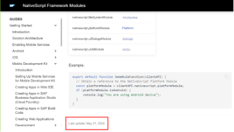

| Versi | Penulis |
|-------|----|
| 1.0 | [Kang Cahya](https://github.com/dyazincahya) |

# BAB I : NATIVESCRIPT


***Gambar 1.1 Logo Nativescript***


**1.1 TENTANG**

Nativescript adalah sebuah *Framework* (Kerangka Kerja) yang dapat membantu Anda untuk membangun sebuah aplikasi seluler pada platform Android atau IOS. Awalnya Nativescript dibuat oleh perusahaan perangkat lunak asal Bulgaria yang bernama Progress. Salah satu produk yang populer salah satunya adalah Kendo UI, di Kantor Saya dulu pernah menggunakan Kendo UI ini, apakah Anda pernah mendengar atau menggunakannya juga?

Nativescript sendiri *“bisa di bilang”* salah satu produk dari Progress yang bersifat Open Source. Di awal kemunculannya, nama lengkap Nativescript adalah *Telerik Nativescript*, namun komunitasnya sendiri menyebutnya dengan Nativescript saja. Tercermin dari Command Line Interface (CLI) yang dimiliki Nativescript yang selalu diawali dengan TNS yang merupakan akronim dari *Telerik Nativescript*, berikut adalah beberapa Command Line Nativescript di awal-awal: 

```bash
tns run android
tns platform remove PLATFORM_NAME
tns build android
tns plugin add PLUGIN_PACKAGE_NAME
etc . . .
```

Saya sendiri mengenal Nativescript sejak versi 3.x.x kurang lebih sekitar semester pertama tahun 2017 (agak kurang mengingatnya). Impresi pertama Saya saat mencoba Nativescript sangatlah luar biasa, bagaimana tidak, hanya dengan menggunakan kode Javascript Saya bisa membuat sebuah aplikasi android yang *Smooth* dan lumayan cepat. Ditambah gestur-Nya yang tidak seperti web, ini mirip seperti aplikasi android yang menggunakan bahasa Native (Java). 

Karena sebelum mengenal Nativescript, untuk kebutuhan membuat aplikasi Mobile Saya menggunakan WebView dari Cordova, dan sebelum Cordova Saya menggunakan Phonegap. Mungkin Anda sebagai seorang Pengembang pasti tahu seperti apa Cordova dan Phonegap, walau belum pernah mencobanya, setidaknya pernah mendengar kedua nama itu.

Pengembangan Nativescript terus dilakukan sampai suatu ketika, sekitar akhir tahun 2019 Progress memutuskan untuk melepas Nativescript dan tanggung jawab pengembangan Nativescript diambil oleh nStudio yang merupakan salah satu mitra lama dari Progress. Sudah 5 tahun berlalu, sampai sekarang tahun 2024, pengembangan Nativescript masih dipegang oleh nStudio dan komunitas. [https://github.com/Nativescript/Nativescript](https://github.com/NativeScript/NativeScript)

Banyak perubahan yang dilakukan semenjak tanggung jawab Nativescript diambil alih oleh nStudio, saat ini Nativescript hanya bernama Nativescript, sudah tidak menggunakan nama *Telerik* lagi, begitu pun ke bagian dalam-dalamnya, salah satunya CLI dan Core Modul. Yang mulanya Command Line menggunakan perintah TNS, sekarang hanya NS saja. lalu modul core Nativescript yang mulanya bernama *tns\_modules* sekarang berubah jadi *@nativescript/core.*

```bash
ns run android
ns platform remove PLATFORM_NAME
ns build android
ns plugin add PLUGIN_PACKAGE_NAME
etc . . .
```

Ada juga perubahan dari sisi *Branding*, yang mana pada logo lama berwarna biru tegas dengan huruf N yang besar dan padding pada Box-Nya tipis, sehingga huruf N lebih dekat dengan tepi Box. Kemudian pada logo baru, warna birunya agak bias ke abu-abuan dengan huruf N yang lebih kecil dan padding pada Box lebih tebal, sehingga huruf N lebih mempunyai jarak dari tepi Box.

              


***Gambar 1.2 Logo Nativescript Lama dan Logo Nativescript Baru***

**1.2 RASA (flavor)**


***Gambar 1.3 Nativescript Flavors***

Selama 10 tahun terakhir Nativescript sudah banyak berkembang, saat masih berada di bawah Progress, nativescript mempunyai 2 rasa, yakni :

- Javascript
- Typescript

Kemudian setelah Nativescript berada di bawah nStudio, mulai banyak pembaharuan yang dilakukan, salah satunya adalah soal Rasa, yang mulainya hanya mempunyai 2 rasa, sekarang Nativescript memiliki banyak rasa, di antaranya ada :

- Javascript (<https://docs.nativescript.org>) 
- Typescript (<https://docs.nativescript.org>) 
- Angular (<https://docs.nativescript.org>) 
- Svelte (<https://svelte-native.technology>) 
- Vue (<https://nativescript-vue.org>) 
- ReactJS (<https://react-nativescript.netlify.app>) 
- Capacitor (<https://capacitor.nativescript.org>) 
- Ionic (<https://v8.docs.nativescript.org/plugins/ionic-portals.html>) 
- SolidJS (<https://stackblitz.com/edit/nativescript-solid>) 

Walau di Nativescript mempunyai banyak rasa namun hanya beberapa yang bisa di bilang sudah matang, di antaranya :

- Javascript
- Typescript
- Angular

Kenapa Saya katakan sudah matang? Alasannya karena 3 rasa di atas sudah mempunyai dokumentasi yang baik, dan dari segi kode bisa di bilang stabil, begitu pun plugin-pluginnya. Tidak matang bukan berarti tidak bagus, setiap orang punya selera rasa yang berbeda-beda, dari pada berdebat soal rasa mana yang lebih baik, mending Anda mulai mencobanya dan rasakan rasa mana yang menurut Anda paling enak. Anda dapat memulainya dengan mengetikan perintah berikut jika ingin membuat Proyek baru di Nativescript.

```bash
ns create myFirstApp --angular // or --ng for short
ns create myFirstApp –vue
ns create myFirstApp --vue --ts // for vue with typescript
ns create myFirstApp --react
ns create myFirstApp --js
ns create myFirstApp –svelte
```

**1.3 RUNTIME**

Di awal kemunculannya, Nativescript hanya di peruntukan untuk membangun aplikasi pada perangkat seluler dengan platform Android dan IOS, namun seiring berjalannya waktu, teknologi semakin berkembang dan Nativescript dengan komunitasnya secara aktif ikut menaiki ombak perkembangan teknologi itu sampai saat ini. 

**1.3.1 VisionOS**

Apakah Anda masih ingat dengan acara WWDC23 yang di adakan oleh Apple Inc? Acara tersebut diadakan pada pertengahan tahun 2023 tepatnya di bulan Juni. Saat itu memperkenalkan Device AR baru mereka yang bernama Vision OS, bentuknya sendiri seperti Kacamata. <https://developer.apple.com/visionos> 

 

***Gambar 1.4 VisionOS Device***


Saat ini Nativescript telah menambahkan Runtime baru untuk VisionOS, yang mana dengan Nativescript Anda dapat membuat aplikasi untuk VisionOS. Jika Anda tertarik untuk mencobanya, Untuk memulai Development pastikan Environment di lokal Anda menggunakan versi Xcode 15.2 atau versi lebih baru.

Anda dapat menjalankan perintah berikut untuk memulai membangun aplikasi untuk VisionOS :

```bash
// Javascript
ns create myApp --vision

// Angular
ns create myApp --vision-ng

// ReactJS
ns create myApp --vision-react

// SolidJS
ns create myApp --vision-solid

// Svelte
ns create myApp --vision-svelte

// Vue (3.x)
ns create myApp --vision-vue
```

Lengkapnya Anda bisa mengunjungi laman dokumentasi Nativescript di sini :

<https://docs.nativescript.org/guide/visionos>

**1.3.2 ANDROID**

Tentu Anda tidak asing dengan ini, Runtime ini memungkinkan Nativescript berjalan di perangkat Android (seperti Android Phone, Tablet, dan ChromeBook) menggunakan *V8 Javascript Engine* (<https://v8.dev>) dari Google. 

- V8 Javascript Engine

V8 adalah sebuah Engine yang dibuat oleh Google yang mana ini berfungsi untuk mengeksekusi Javascript/Typescript di Nativescript. Akses langsung ke API native melalui V8 Engine memastikan performa aplikasi yang baik

- Bridge

Lalu ada Bridge, yang mana Bridge ini berfungsi untuk menghubungkan kode Javascript dengan API native Android, dan memungkinkan interaksi dua arah. Jadi dengan adanya Bridge ini, Anda dapat menuliskan bahasa Native android Java di dalam file Javascript.

```javascript
/* sample.js */
import {
    Utils
} from "@nativescript/core";
export function saveToPhoneBook() {
    const contact = {
        name: "Kang Cahya",
        phoneNumber: "08123456789",
        email: "admin@kang-cahya.com",
        7
        address: "123 Main St, Indonesia",
        company: "ABC Company",
        jobTitle: "Software Engineer",
        notes: "This is a sample note.",
        website: "https://kang-cahya.com",
    };
    const uri = android.net.Uri.parse("content://contacts/people/");
    const intent = new android.content.Intent(
        android.content.Intent.ACTION_INSERT,
        uri
    );
    intent.setType(android.provider.ContactsContract.Contacts.CONTENT_TYPE);
    // Basic Information
    intent.putExtra(android.provider.ContactsContract.Intents.Insert.NAME, contact.name);
    intent.putExtra(android.provider.ContactsContract.Intents.Insert.PHONE,
        contact.phoneNumber);
    intent.putExtra(android.provider.ContactsContract.Intents.Insert.EMAIL, contact.email);
    // Address Information
    intent.putExtra(android.provider.ContactsContract.Intents.Insert.POSTAL, contact.address);
    // Organization
    intent.putExtra(android.provider.ContactsContract.Intents.Insert.COMPANY, contact.company);
    intent.putExtra(android.provider.ContactsContract.Intents.Insert.JOB_TITLE, contact.jobTitle);
    // Additional Information
    intent.putExtra(android.provider.ContactsContract.Intents.Insert.NOTES, contact.notes);
    intent.putExtra(android.provider.ContactsContract.Intents.Insert.WEBSITE, contact.website);
    Utils.android.getCurrentActivity().startActivity(intent);
}
```

Kode di atas adalah contoh kode sederhana berfungsi untuk mengirimkan data nomor Handphone pada default aplikasi kontak yang ada di Android. Ada juga contoh lain, kode di bawah ini berfungsi untuk menampilkan Toast dengan menggunakan bahasa Native Java Android yang di tulis di dalam file Javascript :

```javascript
/** sample.js **/
import {
    fromObject
} from "@nativescript/core";
export function onPageLoaded(args) {
    const page = args.object;
    page.bindingContext = fromObject({});
}
export function showToast() {
    const context = Application.android.foregroundActivity || Application.android.startActivity;
    const Toast = android.widget.Toast;
    Toast.makeText(context, "Hello from Nativescript!", Toast.LENGTH_SHORT).show();
}
```

```xml
<!-- sample.xml -->
<Page
	xmlns="http://schemas.nativescript.org/tns.xsd" loaded="onPageLoaded">
	<ActionBar title="Nativescript Android Example" />
	<StackLayout>
		<Button text="Show Toast" tap="showToast" />
	</StackLayout>
</Page>
```

Selain menggunakan Bahasa Native Android Java, Anda juga bisa menggunakan bahasa native android Kotlin, Hanya saja caranya agak berbeda dengan Java, untuk kotlin Anda tidak bisa langsung mengetikan kode Kotlin-Nya pada Javascript, untuk lebih lengkapnya bagian ini akan di bahas lebih lanjut di bab berikutnya.

**1.3.3 IOS**

Runtime ini memungkinkan Nativescript berjalan di perangkat IOS (meliputi iPhone dan  iPad). Jika pada Runtime android menggunakan V8 Javascript Engine, untuk Runtime IOS, nativescript menggunakan *JavaScriptCore* dari Apple.

<https://developer.apple.com/documentation/javascriptcore>

- JavaScriptCore

JavaScriptCore sendiri berfungsi untuk melakukan eksekusi pada Javascript/TypeScript.

- Bridge

Pada Runtime IOS pun ada Bridge, yang kurang lebih sama fungsinya seperti pada Runtime android.

```javascript
/* sample.js */


import {
    Utils
} from "@nativescript/core";


export function saveToPhoneBook() {

    const phoneNumber = "1234567890";

    const url = telprompt: $ {
        phoneNumber
    };

    Utils.ios.openURL(url);

}
```

Kode di atas adalah contoh kode sederhana berfungsi untuk mengirimkan data nomor Handphone pada default aplikasi kontak yang ada di IOS. Ada juga contoh lain, berikut adalah contoh untuk memunculkan sebuah alert saat tombol di tekan menggunakan kode native di IOS yang di tulis di dalam file Javascript :

```javascript
/* sample.js */


import {
    fromObject
} from "@nativescript/core";


export function onPageLoaded(args) {

    const page = args.object;

    page.bindingContext = fromObject({});

}

export function showAlert() {

    const alertController = UIAlertController.alertControllerWithTitleMessagePreferredStyle("Nativescript", "Hello from Nativescript!", UIAlertControllerStyle.UIAlertControllerStyleAlert);

    const alertAction = UIAlertAction.actionWithTitleStyleHandler("OK", UIAlertActionStyle.UIAlertActionStyleDefault, null);

    alertController.addAction(alertAction);

    const topViewController = UIApplication.sharedApplication.keyWindow.rootViewController;

    topViewController.presentViewControllerAnimatedCompletion(alertController, true, null);

}
```

```xml
<!-- sample.xml -->
<Page
	xmlns="http://schemas.nativescript.org/tns.xsd" loaded="onPageLoaded">
	<ActionBar title="Nativescript iOS Example" />
	<StackLayout>
		<Button text="Show Alert" tap="showAlert" />
	</StackLayout>
</Page>
```

**1.4 PERKEMBANGAN TEKNOLOGI**

Saat ini banyak sekali teknologi baru bermunculan untuk membuat aplikasi android, kurang lebih sejak 15 tahun terakhir, dari mulai teknologi *WebView*, *Hybrid* dan *Native*. Para penggiat teknologi berlomba-lomba membuat yang terbaik, entah itu penggiat dengan basis komunitas atau perusahaan.

**1.4.1 WebView Apps**

WebView adalah sebuah teknologi yang memungkinkan aplikasi menampilkan konten web di dalam Apps. Gambaran sederhana sebuah WebView adalah saat Anda mencoba membuka sebuah halaman web di browser Handphone, itulah yang di sebut dengan WebView. 

Berikut adalah beberapa Teknologi WebView yang pernah ada :

- Phonegap
- Cordova

Keduanya menggunakan WebView untuk menjalankan aplikasi berbasis HTML, CSS, dan Javascript dalam kerangka native. Walau menggunakan teknologi WebView keduanya masih punya akses ke API Native menggunakan plugin-plugin yang tersedia, memungkinkan juga mengakses fitur seperti kamera, GPS, dan penyimpanan lokal. 

Biasanya yang menggunakan ini adalah Pengembang yang ingin mengonversi Aplikasi Web Base ke dalam bentuk Aplikasi Mobile dengan cara cepat. Adapun perubahan yang akan di lakukan oleh Pengembang ketika mengonversi webnya ke bentuk Aplikasi Mobile ialah tampilannya harus dibuat responsif agar enak di lihat.

**1.4.2 Hybrid Apps**

Hybrid Apps adalah Aplikasi Mobile yang dikembangkan menggunakan Teknologi Web seperti HTML, CSS, dan Javascript, tetapi berjalan di dalam kontainer native yang memungkinkan mereka di install dan dijalankan di perangkat Mobile seperti aplikasi native. Hybrid Apps biasanya menggabungkan elemen dari aplikasi web dan aplikasi native.

Contohnya *Nativescript* ini, disisi lain Kita bisa menggunakan API Native yang merupakan komponen dari *Native Apps* dan disisi lainnya Kita masih bisa menggunakan komponen Web Apps seperti CSS, SCSS dan lainnya untuk melakukan Styling tampilan Aplikasi. Kemudian memanfaatkan yang terbaik dari kedua pendekatan untuk memberikan pengalaman pengguna yang baik dengan efisiensi pengembangan yang lebih tinggi.

Kenapa di katakan *“Efisiensi Pengembangan yang lebih tinggi”*?

Karena dengan menggunakan teknologi Hybrid memungkinkan kita membangun aplikasi di dua platform yang berbeda hanya dengan melakukan sekali koding. Tentunya efisiensi itu ada konsekuensinya, ialah Hybrid Apps memang mempunyai performa yang baru, namun semua itu tidak akan bisa melampaui performa dari Native Apps. Berikut adalah beberapa Teknologi Hybrid yang pernah ada :

- IONIC

Ionic pertama kali rilis sekitar tahun 2013 kurang lebih. Saya masih ingat, dulu melihat ini berasa keren banget, berasa Wah Ionic ini. Namun di atas langit masih ada langit, ya seperti itulah hidup, melihatnya saat ini tidak se-Wah dulu. Ionic sendiri adalah sebuah Framework untuk membangun aplikasi Hybrid menggunakan HTML, CSS, dan Angular. Ionic hanya menyediakan komponen UI saja, untuk mengakses API native dan menjalankan aplikasi dalam bentuk Mobile, Ionic memerlukan yang namanya Cordova atau Capacitor.

Mungkin di benak Anda timbul sebuah pertanyaan, kenapa Ionic tidak di masukan ke kelompok WebView Apps?

Alasannya ialah:

- Meskipun menggunakan WebView untuk merender aplikasi, Ionic menawarkan sebuah Framework lengkap dengan komponen UI yang sudah dirancang untuk menyerupai tampilan dan pengalaman native. Ini berarti Pengembang bisa menggunakan komponen seperti ion-button, ion-card, dan lainnya yang memberikan nuansa lebih native dibandingkan aplikasi WebView murni.
- WebView Apps biasanya hanya menjalankan aplikasi web dalam WebView tanpa adanya Framework atau komponen UI tambahan yang dirancang khusus untuk pengalaman Mobile. Juga biasanya hanya menyediakan pengalaman web yang dibungkus dalam WebView, tanpa optimasi atau peningkatan untuk platform Mobile tertentu.
- Ionic sendiri menggunakan Cordova atau Capacitor untuk mengakses API native. Ini berarti Pengembang bisa menggunakan plugin untuk mengakses fitur perangkat seperti kamera, GPS, sensor, dan lainnya yang tidak tersedia dalam aplikasi WebView murni.

Namun dari ketiga alasan itu, nanti di akhir Saya akan coba berikan sebuah Grafik yang bakal memberi gambaran lebih jelas kepada Anda tentang seberapa Hybrid Ionic ini.

- FRAMEWORK7

Framework7 rilis sekitar tahun 2014 kurang lebih. Fitur utamanya fokus pada User Experience yang mana Framework7 banyak menyediakan komponen UI yang menyerupai native. Sangat direkomendasikan untuk Pengembang yang mencari kontrol lebih pada tampilan dan nuansa aplikasi. Framework7 sendiri kurang lebih sama seperti Ionic, ia hanya menyediakan Komponen UI, dan untuk melakukan akses API Native ia memerlukan bantuan dari Cordova. Hanya Saya Framework7 ini lebih bervariasi dibandingkan dengan Ionic, yang mana Ionic hanya mendukung angular, sedangkan Framework7 ada beberapa, seperti Vue, React dan Svelte.

- NATIVESCRIPT

Nativescript di rilis pertama kali sekitar 11 tahun yang lalu, tepatnya sekitar tahun 2014. Nativescript Framework untuk membangun aplikasi Mobile menggunakan Javascript, TypeScript, atau Angular dengan akses penuh ke API native.

- REACT NATIVE

React Native lahir 1 tahun setelah Nativescript rilis, sekitar tahun 2015. React Native adalah Framework open-source yang dibuat oleh Facebook (sekarang Meta) untuk membangun aplikasi Mobile menggunakan ReactJS. Fitur utama yang dimiliki React Native ialah Komponen UI yang dirender menggunakan elemen native, yang mana dapat menghasilkan performa yang lebih baik dibandingkan aplikasi WebView. React Native pun banyak digunakan oleh perusahaan besar untuk aplikasi produksi karena keseimbangan antara performa dan pengembangan cepat.

**1.4.3 Native Apps**

Native Apps merupakan sebuah aplikasi yang memang khusus digunakan dan memang berjalan  pada perangkat atau platform tertentu, native Apps biasanya di buat dengan menggunakan bahasa native pada platform tertentu. Misalnya Android, yang mana bahasa native untuk platform android ialah Java, Kotlin, Flutter (Dart). Ada juga yang menggunakan C++ sebagai bahasa native untuk membuat aplikasi android, namun biasanya C++ digunakan untuk membuat Game, karena dinilai lebih Powerfull.

Untuk IOS sendiri, ada beberapa bahasa native yang dapat digunakan ialah Objective-C dan Swift. Untuk Anda Pengembang lama mungkin tidak asing dengan nama Objective-C, bahasa ini adalah salah satu bahasa tingkat tinggi berorientasi objek yang merupakan pengembangan dari bahasa C. Di kembangkan oleh Brad Cox dan Tom Love pada awal tahun 80-an dan kemudian di populerkan oleh Steve Jobs akhir 80-an sampai 90-an. Untuk Swift-nya sendiri merupakan bahasa baru, yang di rilis sekitar tahun 2014.

**1.5 POSISI NATIVESCRIPT**

Jika ditanya di mana posisi Nativescript? seperti yang sudah di jelaskan di atas, Nativescript ada di kategori Hybrid Apps. Bersaing dengan yang lainnya yang ada di kategori yang sama. Namun yang jadi persoalan, antara yang sudah di sebutkan di atas, Hybrid-nya sendiri lebih condong ke WebView atau ke Native? Agar mendapat sedikit gambaran, Saya akan coba tampilkan datanya dalam bentuk tabel.

|**Teknologi**|**Tahun Rilis**|**Mendekati WebView (1-10)**|**Mendekati Native (1-10)**|**Deskripsi**|
| :- | :- | :- | :- | :- |
|**IONIC**|2013|8\.0|2\.0|Menggunakan HTML, CSS, dan Angular dengan Cordova untuk akses ke API perangkat, fokus pada UI web.|
|**Framework7**|2014|7\.0|3\.0|Menggunakan HTML, CSS, dan Javascript dengan fokus pada pengalaman pengguna yang kaya dan UI komponen.|
|**Capacitor**|2019|6\.0|4\.0|Integrasi mulus dengan Library web modern, akses ke API native dengan plugin.|
|**Nativescript**|2014|2\.4|7\.6|Menggunakan Javascript, TypeScript, atau Angular (Vue, React, SolidJS, Svelte, etc) dengan Binding langsung ke API native.|
|**React Native**|2015|2\.0|8\.0|Menggunakan Javascript dan React, komponen UI dirender menggunakan elemen native.|

Untuk lebih jelasnya Saya akan coba tampilkan datanya dalam bentuk grafik sederhana.


***Gambar 1.5 Diagram macam-macam teknologi Mobile WebView sampai Native***

Jika melihat grafik di atas,  ada 5 yang berada di posisi Hybrid Apps, namun dari 5 itu, hanya 2 dengan Hybrid yang mendekati Native. Dan sisanya Hybrid yang mendekati WebView.

**1.6 NATIVESCRIPT vs REACT NATIVE**

Pada sub pembahasan di atas Kita sudah tahu di mana posisi Nativescript berada, yang jadi pertanyaan, *Kenapa Nativescript ada di bawah React Native?* 

Sebenarnya ada beberapa alasan yang membuat React Native bisa lebih unggul dari pada Nativescript. Untuk bagian ini Saya akan coba bagi menjadi beberapa bagian, alasannya kurang lebih sebagai berikut :

1. **Komponen Native UI**

React Native

Menggunakan sebuah komponen UI yang benar-benar native, seperti View, Text, dan Image, yang diterjemahkan langsung ke elemen native UI di platform Android dan iOS. Yang artinya UI yang dihasilkan oleh React Native benar-benar komponen native, yang memberikan pengalaman pengguna yang konsisten dengan aplikasi native lainnya di platform tersebut.

Nativescript

Meskipun juga memungkinkan penggunaan *API native*, tetapi komponen UI bawaan-Nya tidak selalu langsung diterjemahkan ke komponen native UI. Contohnya : 

- Komponen *ActionBar* akan di terjemahkan menjadi *ActionBar* pada Android dan *UINavigationBar* pada IOS.
- Komponen *ListView* akan di terjemahkan menjadi *RecyclerView* pada Android dan *UITableView* pada IOS.
- Komponen *TabView* akan di terjemahkan menjadi *TabLayout* pada Android dan *UITabBarController* pada IOS.
- Komponen *Dialogs* akan di terjemahkan menjadi *AlertDialog* pada Android dan *UIAlertController* pada IOS.

Ini bisa menyebabkan perbedaan kecil dalam tampilan dan perilaku dibandingkan dengan aplikasi native murni. Faktor ini juga yang menjadikan posisi Nativescript berada di bawah React Native, namun tidak terlalu jauh di bawah React Native, hanya sedikit.

1. **Ekosistem dan Komunitas**

React Native

Memiliki ekosistem yang sangat besar dan aktif, tidak heran, karena React Native sendiri didukung oleh *Facebook* (sekarang Meta) dan banyak perusahaan besar lainnya dan Juga komunitas. Dengan dukungan sebesar itu, arti-Nya ada banyak plugin, alat bantu, dan Library yang dibuat khusus untuk meningkatkan pengalaman pengembangan dan performa aplikasi yang berbasis React Native.

Nativescript

Memiliki komunitas yang aktif. Nativescript juga terus berkembang dan terus diperbaharui sampai saat ini, banyak plugin yang tersedia yang dapat Anda gunakan. Walau  ekosistemnya tidak sebesar React Native. 

1. **Performa**

React Native

Karena menggunakan komponen native UI dan menjembatani Javascript dengan API native melalui "Bridge" yang efisien, performa UI sering kali lebih baik dan lebih konsisten dengan aplikasi native.

Nativescript

Performanya juga bagus, tetapi ada beberapa Overhead tambahan karena menggunakan V8 Engine atau JavaScriptCore untuk menjalankan Javascript dan kemudian memetakan panggilan API ke native. Ini bisa menyebabkan performa yang “sedikit” kurang optimal dalam “beberapa kasus”.

1. **Pengalaman Pengembangan**

React Native

Menyediakan alat seperti "Fast Refresh" (<https://reactnative.dev/docs/fast-refresh>) yang membuat siklus pengembangan lebih cepat dan lebih efisien. Ini memungkinkan Pengembang untuk melihat perubahan secara real-time tanpa perlu me-rebuild aplikasi sepenuhnya.

Nativescript

Nativescript juga memiliki Tools serupa, namanya “LiveSync”, fitur ini memungkinkan perubahan pada kode aplikasi Anda (seperti Javascript, TypeScript, CSS, atau XML) untuk diterapkan pada aplikasi yang sedang berjalan di perangkat atau emulator tanpa perlu melakukan build ulang penuh. Ini sangat mirip dengan konsep Fast Refresh di React Native. Saat kamu menjalankan perintah ns run android atau ns run ios LiveSync sudah Include di dalamnya.

1. **Adopsi di Industri**

React Native

Digunakan oleh banyak perusahaan besar seperti Facebook, Instagram, Airbnb (sebelum beralih ke solusi lain), dan banyak lagi. Penggunaan yang luas ini memberikan keyakinan kepada Pengembang tentang kestabilan dan dukungan jangka panjang dari komunitas dan perusahaan besar.

Nativescript

Nativescript juga digunakan oleh banyak perusahaan, tetapi adopsinya tidak sebesar React Native. Hal ini juga bisa mempengaruhi keputusan Pengembang atau Suatu Perusahaan dalam memilih teknologi berdasarkan dukungan industri.

**Kesimpulan:** Dari 5 poin alasan di atas dapat di simpulkan bahwa React Native merupakan Hybrid Apps lebih mendekati native dalam hal komponen UI, performa, dan pengalaman pengguna karena penggunaan komponen UI yang benar-benar native dan dukungan ekosistem yang besar. Nativescript juga kuat dan fleksibel, namun penggunaan API native tidak selalu menghasilkan komponen UI yang benar-benar native, dan ekosistemnya lebih kecil jika dibandingkan dengan React Native. Walau begitu Nativescript tetap bisa jadi pilihan bagus untuk Anda sebagai Pengembang. Karena mengingat perbedaan keduanya tidak terlalu jauh, keduanya sama-sama hampir mendekati Native jika di bandingkan dengan Hybrid Apps yang lainnya.

**1.7 KENAPA HARUS NATIVESCRIPT?**

Kenapa harus Nativescript? Jelas-jelas React Native lebih baik dari sisi komponen, ekosistem dan performa. Secara kasat mata Faktanya memang begitu, tidak dipungkiri dengan dukungan dari sebuah perusahaan raksasa bernama Facebook, pastinya React Native mengungguli segalanya.

Ketika Anda bertanya kepada seseorang, mana yang lebih bagus antara mobil Lamborghini dan Toyota Avanza, orang tersebut pasti akan menjawab Lamborghini. Dia mungkin akan mulai mendeskripsikan kelebihan Lamborghini, seperti bodi yang lebih keren, kecepatan yang lebih tinggi, dan tentunya kesan mewah yang membuat Anda merasa bangga saat membawanya bersama pasangan. Namun, bagaimana jika pertanyaannya seperti ini:

- Apakah mobil itu bisa membawa banyak barang?
- Apakah mobil itu bisa dibawa mudik ke pelosok?
- Apakah mobil itu bisa membawa penumpang lebih dari 4 orang?
- Apakah bakal aman jika melewati jalanan rusak dan berlumpur?

Tentu saja jawabannya untuk semua pertanyaan itu adalah tidak. Mungkin ada yang menjawab iya, tapi itu akan terasa dipaksakan dan bisa berisiko merusak mobil. Untuk menjawab pertanyaan-pertanyaan tersebut, Toyota Avanza adalah solusi yang lebih tepat untuk menyelesaikan masalah tersebut.

Dari ilustrasi di atas, yang ingin saya sampaikan adalah bahwa yang keren dan kencang seperti Lamborghini belum tentu dapat memenuhi kebutuhan yang kita butuhkan. Namun, Toyota Avanza, meskipun tidak sekencang dan sekeren Lamborghini, justru bisa memenuhi kebutuhan tersebut. Toyota Avanza memiliki kelebihan yang tidak dimiliki Lamborghini, yaitu kekuatan, keandalan, dan fleksibilitas karena dapat digunakan di jalan yang rusak maupun jalanan yang bagus.

NativeScript itu seperti Toyota Avanza—kuat dan fleksibel. Bagi Anda, para pengembang web yang ingin mencoba terjun ke dunia pemrograman Mobile, NativeScript akan sangat mudah dipelajari. Jika Anda sudah mengenal JavaScript dalam pemrograman web, Anda akan merasa nyaman menggunakan NativeScript karena ia juga menggunakan JavaScript. Jadi, Anda tidak perlu mempelajari hal baru untuk masuk ke dunia pemrograman Mobile. Berbeda dengan React Native, meskipun ReactJS adalah JavaScript, Anda harus terlebih dahulu mempelajari cara kerja ReactJS. Di dunia IT, hanya mengandalkan kecepatan dan popularitas saja tidak cukup jika Anda tidak bisa memanfaatkan dan memaksimalkan Tools yang Anda gunakan dengan baik—semuanya harus didasarkan pada kebutuhan.

*Seberapa kuat dan fleksibel Nativescript?*

Mengenai Ekosistem, jika dibandingkan dengan React Native tentunya Nativescript akan kalah. Tetapi jika coba melihat Nativescript dulu dan sekarang, tentunya sekarang sudah jauh lebih baik dengan seiring berjalannya waktu. Ekosistem di Nativescript itu fleksibel, saat Anda membutuhkan suatu plugin dan plugin yang Anda cari memang tidak ada, Anda dapat mencari Helper atau Library dari Bahasa Native-Nya, yang kemudian Anda bisa coba terapkan langsung pada Proyek Nativescript Anda. Contohnya ada pada repositori PoolPartyFM ini:

<https://github.com/NewbieScripterRepo/PoolPartyFM> 

PoolPartyFM adalah sebuah aplikasi Streaming Radio yang dibuat menggunakan NativeScript. Aplikasi ini bukan buatan saya, namun saya menemukannya dari postingan 'Showcase' di komunitas NativeScript Global. Jika Anda melihat kode aplikasi tersebut, untuk media Player pada bagian pemutar suara Streaming, aplikasi ini menggunakan Library dari bahasa native Java yang dibuat oleh Google, yaitu ExoPlayer (<https://github.com/google/ExoPlayer>). Library tersebut diterapkan langsung pada proyek NativeScript-nya tanpa menggunakan perantara plugin.

Pada file *App\_Resources/Android/app.gradle* ia menambahkan *Dependencies* baru :

```gradle
implementation 'com.google.android.exoplayer:exoplayer:2.19.1'
```


Kemudian ia menulis sebuah Utils pada file typescript-Nya yang diberi nama *AudioPlayer.ts,* Jika Anda membaca file tersebut, isinya adalah Kode Native Java yang di tulis di dalam Typescript, *<https://github.com/NewbieScripterRepo/PoolPartyFM/tree/main/src/utils>*. 

Jika Anda menggunakan React Native, Anda tidak akan bisa sefleksibel Nativescript yang bisa menulis Bahasa Native pada file Javascript atau Typescript. Pada dasarnya di dunia ini tidak ada yang sempurna, semua punya kelebihan dan kekurangan-Nya masing-masing. 

Selain hal yang sudah dijelaskan di atas, jika ditanya, *'Kenapa Harus NativeScript?'* Saya akan mencoba mengambil poin-poin dari buku NativeScript pertama saya, sekaligus menyegarkan ingatan akan buku tersebut. Poin-poin mengenai *'Kenapa Harus NativeScript?'* dalam buku sebelumnya adalah sebagai berikut:

- **UI (User Interface) yang cantik dan mudah diakses:** NativeScript memungkinkan pembuatan antarmuka pengguna yang menarik dan responsif, dengan dukungan penuh untuk komponen-komponen UI native.
- **Setiap kode yang kita ketik dengan JavaScript, Angular, atau TypeScript akan di-generate menjadi bahasa Native:** NativeScript menerjemahkan kode Anda menjadi kode native, yang berarti aplikasi yang dihasilkan memiliki performa yang sama dengan aplikasi yang dibuat menggunakan bahasa native.
- **Menulis kode Native di dalam Javascript atau Typescript:** Di Nativescript Anda dapat menuliskan kode native di dalam file Javascript atau Typescript secara langsung tanpa perantara plugin atau yang lainnya.
- **Banyak sekali plugin yang bisa dipakai:** NativeScript memiliki banyak plugin yang tersedia di npm, termasuk plugin resmi yang dapat ditemukan di market.nativescript.org atau di docs.nativescript.org/plugins. Plugin ini memudahkan integrasi berbagai fitur dan layanan ke dalam aplikasi Anda.
- **Mudah untuk dipelajari:** Jika Anda sudah Familiar dengan JavaScript, Anda tidak perlu lagi belajar bahasa baru. NativeScript memungkinkan Anda untuk menggunakan JavaScript, dan jika Anda tertarik, Anda juga dapat menggunakan Angular, TypeScript, atau Framework lain yang didukung.
- **Mendukung platform iOS dan Android:** NativeScript memungkinkan pengembangan aplikasi untuk kedua platform ini dengan satu basis kode. Bahkan, NativeScript sudah mendukung platform baru yang diluncurkan oleh Apple pada tahun 2023, yaitu VisionOS.
- **NativeScript berlisensi “Apache 2 Licence”:** Ini berarti Anda dapat membuat aplikasi secara gratis dan tanpa batasan, baik untuk penggunaan pribadi maupun komersial.

**1.8 KOMUNITAS**

Apakah ada komunitas Nativescript di Indonesia? Jawaban-Nya ada, Tapi tidak aktif. Jika Anda mengetikan *Nativescript Indonesia* pada kolom pencarian Facebook, maka akan muncul beberapa Grup Facebook-Nya, tapi jumlah anggota di Grup-Nya tidaklah banyak.


***Gambar 1.6 Group Nativescript Indonesia di Facebook***

Tidak banyak pengguna Nativescript di Indonesia, karena Nativescript sendiri kurang populer di sini. Tapi Anda tidak perlu kuatir soal komunitas, Anda bisa gabung ke di Server Nativescript Global di Discord. Di sana Anda bisa bertanya langsung terkait kendala apa yang Anda sedang di  hadapi, dan anggota-anggota di sana Sangat Aktif memberikan tanggapan mengenai persoalan yang masuk ke sana. Core Tim dari Nativescript pun sangat aktif membantu anggota-anggota-Nya yang sedang mengalami kesulitan. Sesekali Saya menemukan orang Indonesia pengguna Nativescript dan bertanya di sana, dan Saya sendiri pun lumayan aktif ikut menjawab pertanyaan-pertanyaan di sana.

Jika Anda mengajukan pertanyaan di sana usahakan tanyakan pada Channel yang sesuai dengan masalah yang ingin kamu tanyakan. Mungkin pertanyaan Anda tidak akan langsung mendapat jawaban jika bertanya disiang hari, karena memang kebanyakan anggota-anggota di sana berasal dari luar negeri, yang mana zona waktu-Nya berbeda dengan Indonesia, mungkin ketika Anda bertanya saat siang hari, di luar sana posisi-Nya sedang malam dan mereka sedang tidur. Tetapi jika kamu bertanya saat malam hari biasanya akan cepat mendapat jawaban-Nya.

Silakan akses Link berikut untuk mulai bergabung di server Discord komunitas Nativescript Global.

https://nativescript.org/discord


***Gambar 1.7 Server Discord Nativescript Global***

**1.9 ADOPSI INDUSTRI**

Adopsi Nativescript di dunia Industri, khusus-Nya di Indonesia masih belum banyak, karena memang Nativescript tidak begitu populer di sini, jadi tidak ada opsi yang mengarahkan Industri untuk memilih Nativescript sebagai alat Development-Nya. Di Indonesia sendiri cenderung mengikuti arus, ketika ada sesuatu yang lagi ramai, orang-orang mulai berbondong-bondong mengikuti-Nya. Bukan hanya di Indonesia sebenar-Nya, secara umum di negara lain juga begitu. Itu sebuah siklus yang wajar, karena di dunia teknologi para Pengembang harus berusaha mengikuti perkembangan tersebut agar tidak tertinggal.

Untuk di Indonesia sendiri saya kurang begitu tahu perusahaan mana yang mengadopsi Nativescript, namun ada satu perusahaan asal Jerman yang mengadopsi Nativescript pada salah satu Proyek Aplikasi mereka, dan Proyek Aplikasi tersebut masih aktif sampai sekarang dengan menggunakan Nativescript 8.


***Gambar 1.8 SAP Logo***

SAP adalah singkatan dari bahasa Jerman, yaitu *"Systeme, Anwendungen und Produkte in der Datenverarbeitung"* yang dalam bahasa Inggris berarti *"Systems, Applications, and Products in Data Processing"*. SAP merupakan sebuah perusahaan multinasional yang berbasis di Jerman dan terkenal sebagai salah satu penyedia perangkat lunak Enterprise terkemuka di dunia. Mereka juga mengembangkan perangkat lunak untuk membantu Perusahaan mengelola manajemen keuangan, logistik, produksi, dan berbagai aspek bisnis lainnya.

SAP sendiri menggunakan Nativescript untuk pengembangan aplikasi Mobile mereka. Nama proyek-Nya ialah SAP Mobile Development Kit yang di singkat MDK. Ini adalah sebuah platform yang dibangun di atas Nativescript, yang merupakan Framework JavaScript open source untuk membangun aplikasi Mobile native dengan sekali tulis untuk berbagai platform, termasuk IOS, Android, dan Windows.

*Mungkin Anda seperti merasa ada yang aneh, Windows?*

Ya Anda tidak salah dengar, Windows. Sebenar-Nya Nativescript juga mendukung Runtime untuk platform Windows, hanya saja untuk segmen desktop ini kurang begitu di minati, jadi pada buku ini saya hanya Mention tiga Runtime saja, yaitu Android, IOS dan VisionOS. Jika kamu melihat repositori-Nya di Github (<https://github.com/NativeScript/windows-runtime>) pembaharuan terakhirnya sekitar 7 tahun yang lalu, seperti-Nya sudah tidak di kembangkan lagi. SAP mulai mengadopsi Nativescript sekitar tahun 2016, mungkin saat itu Runtime Windows masih aktif di perbaharui. Entah apa yang sekarang digunakan untuk mendukung platform Windows-Nya, yang jelas pada proyek ini SAP masih menggunakan Nativescript.

SAP Mobile Development Kit (MDK) merupakan sebuah platform dari SAP untuk Mobile yang memungkinkan Pengembang membangun aplikasi Mobile native seperti IOS, Android, dan Windows. MDK menyediakan berbagai fitur dan kemampuan untuk membantu Pengembang membangun aplikasi Mobile yang canggih dan berkinerja tinggi dengan cepat dan mudah.

MDK memanfaatkan kekuatan Nativescript untuk memberikan Pengembang berbagai fitur dan kemampuan, seperti :

- User Interface Native: membuat aplikasi Mobile dengan antarmuka pengguna yang indah dan berperforma tinggi yang terasa dan berperilaku seperti aplikasi native di setiap platform.
- Akses ke API Native: Manfaatkan kemampuan API Native, seperti kamera, GPS, dan sensor, untuk membangun aplikasi yang lebih kaya fitur dan interaktif.
- Integrasi SAP: Dapat menghubungkan aplikasi Mobile dengan mudah ke sistem back-end SAP yang mempunyai berbagai API dan layanan SAP.
- Kinerja yang dioptimalkan: Membangun aplikasi Mobile yang berkinerja tinggi dan responsif dengan memanfaatkan kekuatan JavaScript dan platform native.

Berikut adalah beberapa contoh aplikasi SAP pada proyek MDK dengan menggunakan Nativescript:

- SAP Fiori Mobile: SAP Fiori Mobile merupakan Suite aplikasi Mobile yang dibangun dengan MDK dan Nativescript. Aplikasi ini menyediakan akses Mobile ke berbagai proses bisnis SAP, seperti penjualan, faktur, dan manajemen aset.
- SAP Cloud Platform Mobile Services: SAP Cloud Platform Mobile Services menyediakan berbagai layanan untuk membantu Pengembang membangun aplikasi Mobile. Layanan ini termasuk layanan back-end, alat pengembangan, dan template aplikasi.
- SAP Partner Solutions: Banyak mitra SAP mengembangkan aplikasi Mobile dengan MDK dan Nativescript. Aplikasi ini meliputi aplikasi industri, aplikasi vertical, dan aplikasi konsumen.

*Ada pertanyaan seperti ini, katanya SAP Mobile Development Kit (MDK) di Bangun menggunakan SAPU15 (<https://sapui5.hana.ondemand.com>), dan bukan menggunakan Nativescript?*

Pernyataan bahwa SAP Mobile Development Kit (MDK) menggunakan *SAPUI5* dan bukan Nativescript sebenarnya tidak sepenuhnya akurat. 

Memang benar bahwa MDK menyediakan berbagai fitur dan kemampuan untuk membangun aplikasi Mobile dengan *SAPUI5*, sebuah UI Library berbasis HTML5 dan Javascript. SAPUI5 memungkinkan pengembang untuk membangun User Interface Native-Like yang konsisten dengan desktop SAP Fiori. Namun, *Nativescript* juga memainkan peran penting dalam “Arsitektur MDK”.

Jika di dirincikan berdasarkan saat SAP mulai mengadopsi Nativescript, kurang lebih seperti ini Timeline-Nya :

- 2016: SAP meluncurkan MDK, yang dibangun di atas Nativescript.
- 2017: SAP Fiori Mobile, Suite aplikasi Mobile pertama yang dibangun dengan MDK, diluncurkan.
- 2018: SAP Cloud Platform Mobile Services, platform Cloud untuk pengembangan aplikasi Mobile, diluncurkan.
- 2019: SAP merilis Nativescript 3, versi utama pertama dari Framework dalam tiga tahun.
- 2020: SAP meluncurkan SAP Asset Management Mobile, aplikasi Mobile yang dibangun dengan MDK dan Nativescript.
- 2021: SAP meluncurkan SAP Field Service Management Mobile, aplikasi Mobile yang dibangun dengan MDK dan Nativescript.
- 2022: SAP meluncurkan SAP Sales Cloud Mobile, aplikasi Mobile yang dibangun dengan MDK dan Nativescript.
- 2023: SAP merilis Nativescript 8, versi terbaru dari Framework.

Dan tahun 2024, saat buku ini ditulis, terlihat pada laman dokumentasi web SAP, masih ada Nativescript di sana, dengan tanggal pembaharuan dokumentasi terakhir-Nya ialah pada tanggal *21 Mei 2024*, berikut URL Laman dokumentasi-Nya:

<https://help.sap.com/doc/f53c64b93e5140918d676b927a3cd65b/Cloud/en-US/docs-en/guides/getting-started/mdk/advanced/nativescript-framework-modules.html>

Atau Anda bisa pindai QR di bawah untuk mengakses Link dokumentasi SAP di atas :


***Gambar 1.9 QR Link dokumentasi SAP***



***Gambar 1.10 Dokumentasi Nativescript di web SAP***

Perusahaan SAP adalah salah satu contoh saja adopsi Nativescript di dunia industri. Di luaran sana mungkin masih banyak industri yang menggunakan Nativescript, walau mungkin adopsi-Nya tidak sebanyak React Native.

Adopsi industri akan berpengaruh ke seberapa banyak-Nya lowongan pekerjaan yang tersedia. Mungkin kamu akan sangat mudah menemukan lowongan pekerjaan untuk posisi React Native Developer, karena banyak-Nya adopsi pada teknologi tersebut.

Namun Anda tidak perlu berkecil hati atau merasa ragu untuk mempelajari Nativescript. Karena untuk mendapatkan uang dari sebuah teknologi yang kita pelajari tidak selalu bekerja pada orang lain, Anda bisa membuat peluang itu sendiri. Anda bisa menggunakan Nativescript pada Proyek Pribadi yang Anda dapat atau yang lainnya. 

Saya ingin sedikit berbagi tentang pengalaman menggunakan Nativescript. Saya termasuk pengguna lama dan pengguna setia Nativescript, saya tahu dan mulai menggunakan Nativescript dari tahun 2017 akhir kurang lebih. Untuk pekerjaan kantor memang tidak menggunakan Nativescript, tetapi saya menggunakan-Nya untuk Proyek Pribadi. Bukan hanya itu, saat melakukan *Kuliah Kerja Praktik* *(KKP)* dan Skripsi saya menggunakan Nativescript juga. Jika penasaran Anda bisa mengunjungi laman Github ini :

Aplikasi KKP

Frontend Mobile menggunakan Nativescript 6.3

<https://github.com/dyazincahya/kkp-mobile> 

Untuk Backend menggunakan PHP dengan Framework Codeigniter 3.x

<https://github.com/dyazincahya/kkp-backend> 

Aplikasi Skripsi

Frontend Mobile menggunakan Nativescript 6.5

<https://github.com/dyazincahya/skripsi-mobile> 

Untuk Backend menggunakan PHP dengan Framework Codeigniter 3.x

<https://github.com/dyazincahya/skripsi-backend> 

Saya berangkat dari seorang Pengembang Web, saya cukup paham dengan Javascript, saat saya berkenalan dengan Nativescript tentunya tidak butuh waktu lama untuk mempelajarinya, karena dasar Nativescript itu salah satunya adalah Javascript.

Sekitar awal tahun 2024 ini saya mulai aktif di Google Play Store, rencana saya akan membuat aplikasi Mobile gratis atau pun berbayar, mencoba menjual-Nya di sana. Lumayan ada peluang untuk mendapat Cuan di sana, mengingat pengguna Android makin ke sini makin banyak. Dan aplikasi yang saya buat dan publikasikan di Play Store 100% menggunakan Nativescript. Ini adalah URL Laman Pengembang Saya di Play Store, atau bisa pindai QR di bawah untuk mengakses Link-Nya:

<https://play.google.com/store/apps/dev?id=8941046243892038548> 


***Gambar 1.11 Play Store Kang Cahya***

**1.10 Ringkasan**

Yang mula-Nya hanya bisa menggunakan Javascript dan Typescript, kemudian di tambahkanlah dukungan Nativescript Pada Angular. Seiring berjalan-Nya waktu, Nativescript terus berkembang menjadi lebih baik walau tidak ada dukungan perusahaan besar. Dari sisi Nativescript sendiri makin kesini, semakin banyak menambahkan dukungan terhadap Framework Javascript baru, yang mula-Nya hanya mendukung Angular, kemudian sekarang sudah menambahkan Framework baru, seperti VueJS, SolidJS, Svelte dan lain-Nya. Walau secara kematangan dukungan Nativescript pada Framework-Framework tersebut masih jauh dari kata Matang, terutama dari sisi Dokumentasi dan Plugin pendukung, masih banyak kekurangan. Namun cara tersebut merupakan upaya Nativescript untuk menggait para Pengembang yang menggunakan Framework tersebut agar menggunakan Nativescript sebagai opsi untuk membangun aplikasi Mobile-Nya. 

Pergerakan Nativescript bisa dibilang cukup cepat, 1 Tahun setelah VisionOS di luncurkan, Nativescript langsung merilis Runtime baru untuk mendukung Platform baru besutan Apple itu. Saat ini Nativescript mendukung 3 platform, yaitu Android, IOS dan VisionOS.

Nativescript adalah sebuah Framework untuk membangun aplikasi Mobile, yang mana dari sisi performa hampir mendekati Native, sekitar 7/10, kalah 1 poin dari React Native yang punya nilai 8/10. Jika Anda seorang Pengembang Web, Anda tidak akan begitu kesulitan jika menggunakan Nativescript, asalkan Anda mempunyai kemampuan Javascript yang cukup. Selain itu, Nativescript juga fleksibel, yang mana Anda dapat menuliskan Bahasa Native pada file Javascript secara langsung. Hal ini dapat berguna saat Anda tidak menemukan Plugin Nativescript yang Anda inginkan. Anda dapat menggunakan Helper atau Library dari Bahasa Native-Nya langsung.

Walau pengguna Nativescript tidak sebanyak pengguna React Native, tapi komunitas Nativescript sanggatlah aktif dan solid di Discord (<https://nativescript.org/discord>). Anda dapat menanyakan perihal masalah Anda di sana. Dan para anggota di sana siap untuk membantu.

Adopsi Nativescript di dunia Industri tidak sebanyak React Native, kemungkinan Anda tidak akan menemukan persyaratan lowongan kerja menggunakan Nativescript, jikalau ada pun langka. Maka dari itu, jika Anda sungguh-sungguh mempelajari Nativescript,  Anda dapat membuka peluang menghasilkan Cuan dengan Nativescript, dengan menggunakan-Nya pada proyek pribadi atau coba membuat aplikasi mandiri yang gratis atau yang berbayar dan cobalah mempublikasikan aplikasi-Nya di Google Play Store.

