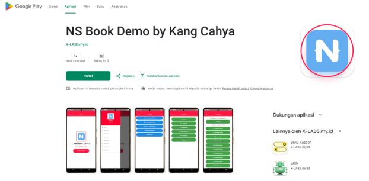
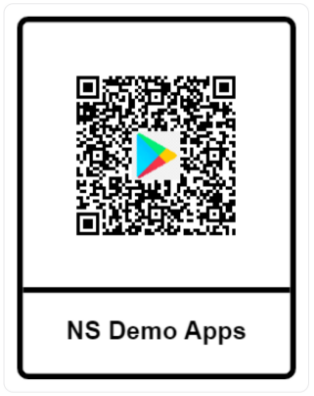

| Versi | Penulis |
|-------|----|
| 1.0 | [Kang Cahya](https://github.com/dyazincahya) |

# BAB II : PANDUAN AWAL DAN KONTEKS PENGEMBANGAN

**2.0 Target Pembaca** 

Sebelum melanjutkan untuk membaca dan mulai belajar dari buku ini, disarankan untuk memperhatikan beberapa hal terlebih dahulu. Buku ini ditujukan bagi Anda yang ingin memasuki dunia pengembangan aplikasi Mobile. Di sarankan atau akan sangat baik jika:

1. Anda memiliki kemampuan dalam menggunakan bahasa pemrograman Javascript, CSS, atau SCSS, atau;
1. Setidaknya tahu dan memahami konsep dasar pemrograman seperti array, objek, variabel, tipe data, atribut, properti, dan konsep dasar lainnya.

Meskipun tidak wajib memiliki kedua kemampuan tersebut, jika Anda memiliki salah satu atau keduanya, hal ini akan sangat membantu Anda dalam memahami isi buku ini dengan lebih baik. Saya tidak akan membahas secara mendetail kode-kode yang dicontohkan dalam buku ini, karena buku ini ditargetkan untuk para pengembang web yang tertarik mengeksplorasi dunia Mobile dengan dasar bahasa pemrograman Javascript.

**2.1 Bahasa Pemrograman yang Digunakan**

Pada buku NativeScript ini, akan banyak membahas tentang penggunaan bahasa pemrograman Javascript, serta CSS atau SCSS dan XML. Selain itu, akan ada topik tentang Pemrograman Native dasar, yang mungkin sedikit menyentuh bahasa pemrograman Kotlin dan Java seperti yang ada di BAB satu. Meskipun Nativescript memiliki banyak pilihan *Flavor* yang dapat Anda gunakan, ke depannya saya tidak akan menyinggung Flavor lain yang ada di NativeScript (seperti TypeScript, Angular, Vue, React, SolidJS, Svelte). Contoh yang akan diberikan di buku Nativescript ini akan sepenuhnya menggunakan Javascript.

**2.2 Perangkat yang Direkomendasikan**

Mengingat perangkat Windows memiliki lebih banyak pengguna, ke depannya saya akan menggunakan perangkat Windows sebagai acuan. Jika Anda menggunakan platform selain Windows, Anda dapat melakukan penyesuaian, baik dari sisi konfigurasi maupun aspek lainnya.

**2.3 Platform Pengembangan**

Saat ini, NativeScript mendukung tiga Runtime, yaitu Android, iOS, dan VisionOS. Buku ini akan lebih berfokus pada platform Android, karena Android dapat dipraktikkan oleh semua orang tanpa memerlukan perangkat khusus untuk pengembangan. Baik di Linux, Windows, atau MAC, semuanya dapat dilakukan. Berbeda dengan platform milik Apple (iOS dan VisionOS), yang membutuhkan perangkat MAC untuk pengembangan, sehingga mungkin lebih sulit untuk dipraktikkan. Jika Anda memiliki perangkat MAC, Anda dapat mencoba menjalankan NativeScript pada Runtime iOS tanpa mengubah kode, karena NativeScript memungkinkan Anda menulis kode sekali dan menjalankannya pada berbagai platform (Android dan iOS) secara bersamaan.

**2.4 Demo Aplikasi**

Semua materi yang ada di dalam buku ini memiliki sebuah demo yang tersedia di aplikasi **NS Book Demo by Kang Cahya**. Anda dapat mengunduh aplikasi tersebut melalui Google Play Store dengan mencarinya menggunakan kata kunci **"NS Book Demo by Kang Cahya"**. Tidak semua BAB dalam buku ini memiliki demo. Hanya BAB yang membahas hal-hal teknis yang disertai dengan demo.

***Gambar 2.1 Aplikasi NS Book Demo by Kang Cahya***

Selain itu, untuk mempermudah, Anda dapat melakukan pemindaian pada QR Code di bawah ini untuk mendapatkan tautan langsung ke Google Play Store, sehingga Anda dapat mengunduh aplikasi Demo-Nya dengan mudah.

***Gambar 2.2 QR Code URL Google Play Store Aplikasi Demo***

