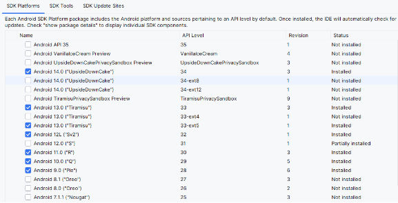
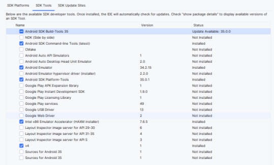
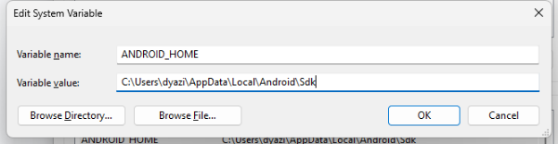
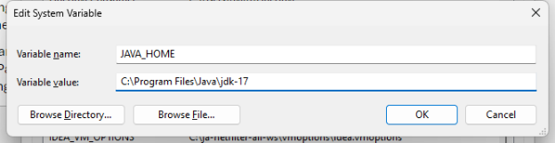
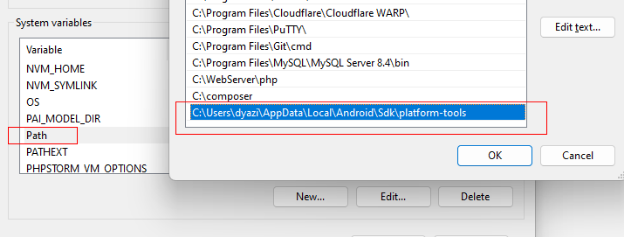
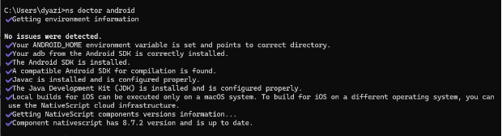

| Versi | Ditulis Pada | Penulis |
|-------|----|-----|
| 1.0 | *Juni 2024* sampai *Agustus 2024* | [Kang Cahya](https://github.com/dyazincahya) |

# BAB III : PERSIAPAN AWAL SEBELUM MEMULAI


Sebelum melakukan pengembangan aplikasi menggunakan Nativescript, ada beberapa hal yang perlu Anda siapkan, yakni : Environment Setup, meliputi pemasangan JDK dan Android SDK, lalu memasang alat-alat terkait seperti Node.js, Nativescript CLI dan lain-lain.

**3.1 Environment Setup**

Pada tahap ini Anda harus melakukan pemasangan alat atau melakukan konfigurasi pada perangkat yang akan Anda gunakan. Saya tidak akan membahas secara rinci terkait step by step pemasangan-Nya, karena pada proses ini bisa saja step-step-Nya berubah seiring berjalannya waktu. Mungkin untuk bagian ini saya hanya akan membagikan hal apa saja yang perlu Anda pasang atau konfigurasi. Untuk step by step pemasangan-Nya Anda dapat mencarinya di Internet. 

**3.1.1 Java Development Kit (JDK)**

JDK merupakan perangkat lunak yang sangat penting jika Anda ingin akan melakukan  pengembangan aplikasi Mobile, terutama untuk platform yang menggunakan bahasa pemrograman Java, seperti Android. Ketika Anda membangun aplikasi Mobile bukan menggunakan bahasa Java, misalnya menggunakan bahasa Kotlin, Anda tetap harus memasang JDK ini pada perangkat Anda. Alasannya sebagai berikut :

- JDK diperlukan untuk mengembangkan aplikasi Android menggunakan Kotlin karena Kotlin dikompilasi menjadi bytecode Java yang kemudian hasil kompilasi kotlin itu dijalankan oleh Java Virtual Machine (JVM).
- Dan alat build seperti Gradle juga memerlukan JDK.
- Selain itu, Android SDK dan Android Studio membutuhkan JDK untuk melakukan kompilasi, <a name="_int_w0pyfjgx"></a>debugging, dan menjalankan aplikasi pada emulator atau real <a name="_int_qvevcysy"></a>device.
- JDK juga menyediakan pustaka standar Java yang sering digunakan dalam proyek Kotlin dan mendukung <a name="_int_sffhxx2s"></a>interoperabilitas penuh antara Kotlin dan Java.

Pada buku ini, saya menyarankan Anda menggunakan JDK versi 17, untuk JDK sendiri Anda dapat mengunduhnya secara gratis di internet :
<https://www.oracle.com/id/java/technologies/downloads/#java17> 

**3.1.2 Android Software Development Kit (SDK)**

Android SDK merupakan kumpulan alat atau pustaka yang Google sediakan untuk mengembangkan aplikasi Mobile Android. SDK ini mencakup banyak komponen penting di antaranya seperti : 

- Kumpulan pustaka dan API yang dapat pengembang gunakan untuk mengakses fitur-fitur pada perangkat Android, contohnya seperti sensor, kamera, GPS, dan lainnya.
- Emulator Android yang berfungsi sebagai alat untuk menguji aplikasi di berbagai versi dan konfigurasi perangkat Android tanpa memerlukan perangkat fisik.
- Build Tools yang berfungsi mengompilasi dan mengemas aplikasi ke dalam bentuk APK atau AAB.
- Platform Tools yang berfungsi untuk pengembangan aplikasi dan debugging, termasuk adb (Android Debug Bridge) dan fastboot.

Di luar itu, pada SDK juga terdapat hal lain seperti dokumentasi dan contoh kode yang mungkin dapat menjadi panduan untuk para pengembang saat mengembangkan sebuah aplikasi.

Untuk memasang SDK, Anda di haruskan memasang Android Studio. Dan berikut adalah beberapa hal yang harus Anda pasang :

1. **SDK Platform**

Pada bagian ini akan berisi daftar Versi Android atau API Level yang dapat Anda gunakan. Untuk API Level tidak perlu Anda pasang semua, Anda bisa ambil API Level yang memang menjadi fokus Anda nanti. 

Misalkan Anda ingin membuat aplikasi Android yang bisa mendukung di Android versi 10 sampai 13 (sama dengan API Level 29 sampai 33), berarti Anda hanya perlu memasang SDK Platform yang sesuai kebutuhan Anda, yang mana nantinya saat melakukan testing di Emulator Anda hanya perlu melakukan testing pada perangkat Android versi 10 sampai 13 saja.

Tetapi jika perangkat Anda mempunyai banyak ruang kosong Anda dapat mencoba memasang semua Versi Android yang Anda mau. SDK Platform ini akan berkaitan dengan Emulator, jika pada SDK platform Anda hanya memasang android versi 10, maka di emulator pun Anda hanya bisa menggunakan emulator dengan Android versi 10, jika ingin menggunakan emulator dengan versi android yang lain, Anda harus memasang dahulu SDK platform dengan versi android terkait.


Untuk SDK platform, saya pribadi memasang android versi 9 sampai 14 (sama dengan API Level 28 sampai 34), kurang lebih seperti ini.



***Gambar 3.1 Daftar Versi Android pada SDK Platform***

1. **SDK Tools**

Untuk SDK Tools dapat di samakan seperti ini, boleh ditambahkan jika memang mau.



***Gambar 3.2 SDK Tools***

1. **Environment Variables**

Setelah JDK dan SDK terpasang, langkah selanjutnya adalah mengonfigurasi Environment Variables pada OS di perangkat Anda. Sebagai contoh pada pembahasan ini saya akan coba menyertakan tangkapan layar dari OS Windows, untuk cara konfigurasinya dapat di sesuaikan jika Anda menggunakan OS selain Windows.

**Pertama,** daftarkan Variable Name baru *ANDROID\_HOME* dengan Variable Value berisi Path yang mengarah ke Folder Android SDK yang sudah terpasang di perangkat Anda, kurang lebih seperti ini;



***Gambar 3.3 Konfig ANDROID\_HOME***

Dari tangkapan layar di atas, bahwa saya meletakan Android SDK pada folder : *C:\Users\dyazi\AppData\Local\Android\Sdk*

**Kedua,** daftarkan Variable Name baru JAVA\_HOME dengan Variable Value berisi Path yang mengarah ke Folder Java JDK yang sudah terpasang di perangkat Anda, kurang lebih seperti ini;



***Gambar 3.4 konfig JAVA\_HOME***

Dari tangkapan layar di atas, bahwa saya meletakan Java JDK pada folder : *C:\Program Files\Java\jdk-17*

**Ketiga,** tidak lupa menambahkan direktori platform tools pada Variable Path, seperti ini;

***Gambar 3.5 menambahkan Platform Tools direktori pada Variable Path***

Pada Environment Variables terdapat Path Variable, Anda harus tambahkan direktori platform tools *(C:\Users\dyazi\AppData\Local\Android\Sdk\platform-tools)* di sana.

Untuk path direktori Android SDK, Java JDK dan Android SDK Platform Tools dapat Anda sesuaikan sesuai lokasi pada perangkat masing-masing. Tidak lupa, jika sudah melakukan perubahan pada konfigurasi Environment Variables, untuk perangkat yang menggunakan OS Windows di haruskan melakukan Restart pada perangkatnya.

**3.2 Tools Setup**

Jika Environment sudah terpasang dan sudah terkonfigurasi dengan baik, pada langkah ini Anda harus memasang beberapa Tools pendukung untuk Nativescript, di antaranya ada Node.js dan Nativescript CLI

**3.2.1 Node.js**

Node.js sendiri mungkin sudah tidak asing untuk Anda, Node.js merupakan sebuah Runtime Javascript yang dibangun di atas mesin V8 Javascript milik Google Chrome. Node.js memungkinkan pengembang untuk menjalankan kode Javascript di sisi server.

Untuk kebutuhan pengembangan menggunakan Nativescript 8, minimal menggunakan Node.js versi 16, disarankan menggunakan versi LTS. Untuk saya sendiri menggunakan Node.js versi 20 LTS.

Saya sarankan untuk melakukan pemasangan Node.js menggunakan NVM (Node.js Version Management). Dengan ini memungkinkan Anda untuk memasang Node.js dengan versi yang berbeda-beda dalam satu perangkat. Jadi jika Anda mempunyai proyek dengan versi Node.js yang berbeda-beda itu tidak akan jadi soal. Informasi lengkapnya Anda dapat mengunjungi laman berikut: *https://github.com/coreybutler/nvm-windows*. Untuk perangkat selain Windows, Anda dapat langsung mencarinya saja di Internet dengan mengetikan kata kunci sesuai perangkat yang Anda gunakan.

**3.2.2 Nativescript CLI**

Jika Node.js sudah terpasang, Anda dapat mengetikan perintah berikut untuk memasang Nativescript CLI, pastikan Anda memasangnya secara global dengan menambahkan –g. Kurang lebih seperti ini perintahnya;

```bash
npm install -g nativescript
```

Pada buku ini, Nativescript yang digunakan ialah Nativescript versi 8.x.x.

**3.3 Verifikasi Environment**

Jika proses setup telah selesai dilakukan semuanya, langkah terakhir ialah melakukan verifikasi pada environment yang sudah kita setup, caranya dengan mengetikan perintah berikut :

```bash
ns doctor android
```

Jika proses setup tidak ada yang kurang maka hasilnya akan seperti ini;



```
✔ Getting environment information No issues were detected.
✔ Your ANDROID_HOME environment variable is set and points to correct directory.
✔ Your adb from the Android SDK is correctly installed.
✔ The Android SDK is installed.
✔ A compatible Android SDK for compilation is found.
✔ Javac is installed and is configured properly.
✔ The Java Development Kit (JDK) is installed and is configured properly.
✔ Local builds for iOS can be executed only on a macOS system. To build for iOS on a different operating system, you can use the NativeScript cloud infrastructure.
✔ Getting NativeScript components versions information...
✔ Component nativescript has 8.7.2 version and is up to date.
```

Untuk Anda yang mencoba melakukan setup pada platform IOS, bisa coba jalankan perintah berikut:

```bash
ns doctor ios
```


**3.4 Ringkasan**

Untuk memulai membuat aplikasi Mobile dengan Nativescript, ada beberapa hal yang perlu di setup, di antaranya adalah sebagai berikut:

- Java Development Kit (JDK), disarankan menggunakan JDK versi 17.
- Android SDK, pastikan semuanya sudah ter-setup dengan baik.
- Pastikan Variable ANDORID\_HOME dan PATH pada Environment Variables sudah ter-setup, setelah itu jangan lupa restart perangkat Anda.
- Node.js, direkomendasikan menggunakan versi 20 LTS
- Pastikan Anda memasang Nativescript CLI di global, perhatikan tanda –g saat memasang Nativescript CLI menggunakan NPM, pada buku ini Nativescript CLI yang digunakan adalah versi 8.7.x atau lebih baru. Dan Nativescript Core yang di gunakan adalah versi 8.7.x atau lebih baru.
- Lakukan verifikasi environment yang sudah Anda setup dengan mengetikan perintah *ns doctor.* Jika menemukan kendala Anda dapat mencari referensi di Internet.
