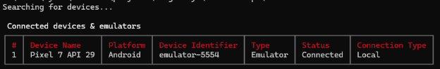
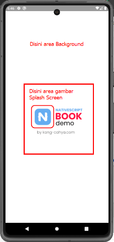
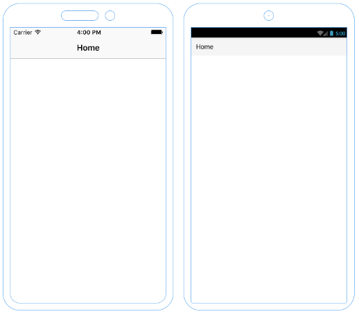
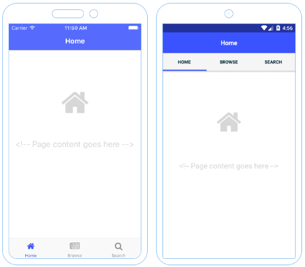
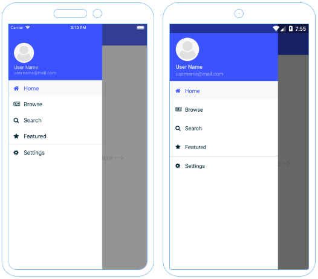
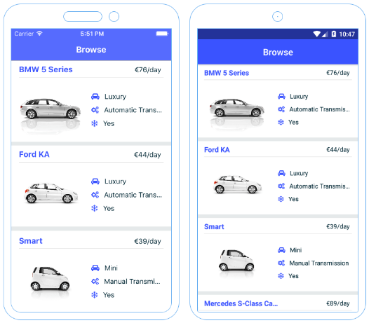
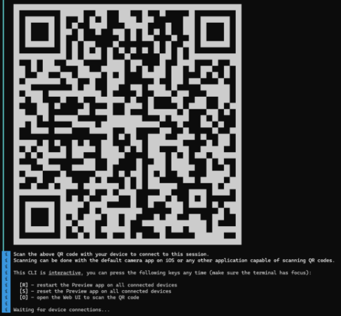

| Versi | Penulis |
|-------|----|
| 1.0 | [Kang Cahya](https://github.com/dyazincahya) |

# BAB IV : MEMULAI MEMBUAT PROYEK BARU


Untuk mulai membuat proyek baru, pastikan pada bab sebelumnya Anda sudah melakukan setup dengan baik, untuk proses membuat proyek baru kita akan coba memanfaatkan perintah yang sudah disediakan oleh Nativescript, namun sebelum masuk ke tahap membuat proyek baru, kita akan coba berkenalan dengan perintah-perintah yang ada di Nativescript.

**4.1 Nativescript CLI**

CLI merupakan akronim dari Command Line Interface, adalah sebuah antarmuka berupa baris perintah yang memungkinkan Anda (sebagai pengguna) dapat berinteraksi dengan perangkat lunak atau sistem operasi berbasis perintah. Dalam hal ini Anda sebagai pengguna dapat memerintahkan Nativescript untuk melakukan suatu hal yang Anda perintahkan. 

1. **ns create**

Perintah ini digunakan untuk membuat proyek baru, perintah lengkapnya kurang lebih seperti ini :

```bash
// PERINTAH TANPA TEMPLATE

// format
ns create <project_name> --<flavor>

// contoh
ns create myFirstApps --js
```

```bash
// PERINTAH DENGAN TEMPLATE 
 
// format 
ns create <project_name> --template <template-package-name or path-to-template>

// contoh
ns create <project_name> --template @nativescript/template-blank
```

Untuk *template-package-name* atau *path-to-template* bisa berupa URL repositori github, namun secara default untuk template akan mengarah pada repositori template Nativescript, lengkapnya Anda dapat mengunjungi laman berikut :

[github.com/NativeScript/nativescript-app-templates/tree/main/packages](https://github.com/NativeScript/nativescript-app-templates/tree/main/packages)*   

2. **ns run atau ns debug dan ns build**

Perintah ini digunakan menjalankan, men-debug dan mem-build aplikasi Nativescript pada emulator atau perangkat fisik. Perintah lengkapnya kurang lebih seperti ini :

```bash
// format
ns run <platform_name>
ns debug <platform_name>
ns build <platform_name>

// contoh
ns run android
ns run ios
ns debug android
ns debug ios
ns build android
ns build ios
```

3. **ns platform dan ns plugin**

Perintah ini berfungsi untuk menampilkan, menambahkan, memperbaharui dan menghapus platform atau plugin. Perintah lengkapnya kurang lebih seperti ini :

```bash
// format
ns platform list
ns platform add <platform_name>
ns platform update <platform_name>
ns platform remove <platform_name>
ns plugin list
ns plugin add <plugin_package_name>

// untuk update semua plugin
ns plugin update 

// untuk update plugin tertentu saja
ns plugin update <plugin_package_name> 

ns plugin remove <plugin_package_name>

// contoh
ns platform list
ns platform add android
ns platform add ios 
ns platform update android 
ns platform update ios  
ns platform remove android
ns platform remove ios
ns plugin list
ns plugin add @nativescript/google-pay

// untuk update semua plugin
ns plugin update 

ns plugin remove @nativescript/google-pay
```

4. **ns clean**

Perintah ini berfungsi untuk membersihkan folder-folder artefak pada proyek Nativescript Anda, seperti: folder *hooks, platforms, node\_modules dan package-lock.json*, kemudian saat Anda menjalankan perintah *ns debug* atau *ns run*, folder artefak tersebut akan terbuat secara otomatis. 

Ketika Anda membuat aplikasi web menggunkaan Javascript, terkadang Anda perlu melakukan *Clear Cache* pada *Browser* atau Melakukan *Re-install* pada *Package.json* Nya, nah perintah *ns clean* ini kurang lebih fungsinya sama seperti itu.

```bash
// contoh
ns clean

// hasil
⠋ Cleaning project...
✔ Cleaned directory hooks
ℹ Skipping platforms because it doesn't exist.
✔ Cleaned directory node_modules
✔ Cleaned file package-lock.json
✔ Project successfully cleaned.
```

5. **ns devices**

Perintah ini berfungsi untuk menampilkan daftar semua perangkat fisik atau emulator yang sudah siap dan sudah terhubung. Saat kita ingin mencoba menjalankan aplikasi, perangkat fisik atau emulator kita sudah siap, namun terkadang status perangkat yang sudah siap itu belum tentu sudah terhubung. Maka dari itu untuk memastikan perangkat sudah terhubung, Anda dapat memastikannya dengan menggunkaan perintah ini.

```bash
// contoh
ns devices

// hasil ada pada gambar di bawah ini  
```

***Gambar 4.1 Hasil dari perintah ns devices***


6. **ns doctor**

Perintah ini berfungsi untuk mendiagnosis apakah Environment yang kita setup apakah sudah oke atau belum, perintah ini juga akan memberi tahu apakah Resource yang Anda gunakan sudah yang terkini atau belum. Laporan yang tampil pada saat menjalankan perintah ini meliputi: ANDROID\_HOME variabel, Android Debug Bridge (ADB), Android SDK, Kompatibilitas Android SDK, Javac, JDK, Nativescript Core komponen, Nativescript IOS Komponen dan Nativescript Android Komponen.

```bash
// contoh
ns doctor

// hasil
✔ Getting environment information
 
No issues were detected.
✔ Your ANDROID_HOME environment variable is set and points to correct directory.
✔ Your adb from the Android SDK is correctly installed.
✔ The Android SDK is installed.
✔ A compatible Android SDK for compilation is found.
✔ Javac is installed and is configured properly.
✔ The Java Development Kit (JDK) is installed and is configured properly.
✔ Local builds for iOS can be executed only on a macOS system. To build for iOS on a different operating system, you can use the NativeScript cloud infrastructure.
✔ Getting NativeScript components versions information...
✔ Component nativescript has 8.7.2 version and is up to date.
✔ Component @nativescript/core has 8.7.2 version and is up to date.
✖ Component @nativescript/ios is not installed.
✖ Component @nativescript/android is not installed.
```

7. **ns update**

Perintah ini berfungsi untuk memperbaharui versi Nativescript Platform (android atau ios) dan Versi Nativescript plugin. Jika perintah ini dijalankan, maka semuanya akan di perbaharui ke versi terbaru. Jadi hati-hati ketika menjalankan perintah ini, jika Anda hanya ingin memperbaharui versi plugin atau platform tertentu saja, saya sarankan untuk menggunakan perintah berikut agar lebih tepat sasaran:

```bash
ns platform update <platform_name>  

ns plugin update <plugin_package_name>
```

8. **ns resources generate icons**

Perintah ini digunakan untuk meng-generate Ikon Aplikasi, saat Anda memulai membangun aplikasi menggunakan Nativescript, Ikon bawaannya akan menggunkan logo Nativescript, untuk mengganti ikon aplikasinya Anda bisa menggunakan perintah ini, agar tidak ribet harus melakukan Resize ikon secara manual ke ukuran *hdpi, ldpi, mdpi, nodpi, xhdpi, xxhdpi* dan *xxxhdpi*. 

Sebelum menjalankan perintah ini, Anda perlu menyiapkan dahulu ikonnya, saya sarankan ukuran ikon di sekitar 512px (rasio 1:1, square), alasannya agar ikon ini dapat di gunakan saat akan melakukan publikasi di Google Play Store. Karena ikon yang di gunakan di Google Play Store harus berukuran 512px. Jika ikon sudah siap Anda bisa menjalankan perintah berikut :

```bash
// format
ns resources generate icons <image-source-path>

// contoh
ns resources generate icons C:\IconFolder\myicon.png
```

9. **ns resources generate splashes**

Perintah ini berfungsi untuk mengubah gambar pada Splash Screen aplikasi. Singkatnya Splash screen merupakan sebuah layar pembuka yang muncul saat aplikasi atau perangkat lunak sedang dimuat atau baru dijalankan. Ukuran untuk gambar splash screen sendiri saya menyarankan Anda membuatnya dalam ukuran 1000px (1:1, square). Perintah lengkapnya kurang lebih seperti ini:

```bash
// format
ns resources generate splashes <image-source-path> --background <color-code>

// contoh
ns resources generate splashes C:\IconFolder\mysplash.png --background #FFFFFF
```

Pada contoh perintah di atas dapat di artikan bahwa gambar splash screen diletakan di folder *IconFolder* yang berada di Drive C, dengan Background splash screen berwarna putih (#FFFFFF). Lebih jelasnya Anda dapat melihat gambar Splash Screen berikut.



***Gambar 4.2 Splash Screen***

10. **ns package-manager set**

Perintah ini berfungsi untuk mengatur Default Package Manager, jika di perangkat lokal Anda terpasang beberapa package  manager, Anda dapat menggantinya dengan perintah ini, saya asumsikan Anda memasang 4 package manager (NPM, Yarn, pnpm dan Yarn2). Secara default package manager yang digunakan adalah NPM,  namun Anda dapat mengubahnya dengan perintah berikut.

```bash
// format
ns package-manager set <package-manager-name>

// contoh
ns package-manager set npm
ns package-manager set yarn
ns package-manager set yarn2
ns package-manager set pnpm
```

11. **ns help**

Untuk poin 1 sampai 10 adalah perintah-perintah pada Nativescript CLI yang umum dan paling sering saya gunakan dan kebanyakan orang gunakan. Namun jika Anda punya kebutuhan lain, Anda dapat melihat informasi lengkap seputar Nativescript CLI dengan cara menjalankan perintah.

```bash
ns help
```

**4.2 Proyek Baru**

Untuk memulai membuat proyek baru di Nativescript, Anda cukup menjalankan perintah seperti berikut

```bash
// rasa typescript
ns create myFirstApp

// rasa angular (gunakan –ng untuk penulisan yang lebih singkat)
ns create myFirstApp –angular
ns create myFirstApp –ng

// rasa vueJS (tambahkan –ts jika ingin menggunakan vue dengan typescript)
ns create myFirstApp --vue
ns create myFirstApp --vue --ts 

// rasa reactJS
ns create myFirstApp --react

// rasa javascript
ns create myFirstApp --js

// rasa svelte
ns create myFirstApp --svelte
```

Saat membuat proyek baru, jika Anda hanya menjalankan perintah

```bash
ns create <project_name>
```

secara default rasa yang di gunakan adalah Typescript, Anda dapat menggunakan gunakan –js jika ingin menggunakan rasa Javascript.  Selain itu Anda juga bisa memakai Template-template yang sudah Nativescript sediakan guna untuk memudahkan Anda saat akan memulai membuat aplikasi baru. Ada 4 template yang Anda dapat gunakan di antaranya adalah Blank Template, Tabs Template, Drawer Template dan List & Detail Template. 

1. **Blank Template**


***Gambar 4.3 Blank Template***

Seperti namanya, template ini tidak ada isinya, yang muncul saat pertama kali hanya tampilan kosong saja, seperti yang ada pada gambar di atas, untuk menggunakan template ini, Anda bisa menjalankan perintah berikut

```bash
// rasa javascript
ns create myFirstApp --template @nativescript/template-blank

// rasa typescript
ns create myFirstApp --template @nativescript/template-blank-ts
```


2. **Tabs Template**



***Gambar 4.4 Tabs Template***

Template ini menyediakan tampilan bawaan dengan Navigasi Tab, seperti yang terlihat pada gambar di atas, Dengan template ini tampilan bawaan sudah otomatis di aturkan, Anda tinggal memodifikasinya sesuai keinginan Anda. Untuk menggunakan template ini, Anda bisa menjalankan perintah berikut

```bash
// rasa javascript 
ns create myFirstApp --template @nativescript/template-tab-navigation 
 
// rasa typescript 
ns create myFirstApp --template @nativescript/template-tab-navigation-ts
```

1. **Drawer Template**



***Gambar 4.5 Drawer Template***

Template ini menyediakan tampilan bawaan berupa Drawer, sebuah menu yang muncul dari samping seperti yang ada pada gambar di atas, semua sudah terkonfigurasi dengan baik, Anda tinggal memodifikasinya sesuai yang Anda inginkan. Untuk menggunakan template ini, Anda bisa menjalankan perintah berikut

|<p><br>// rasa javascript  </p><p>ns create myFirstApp --template @nativescript/template-drawer-navigation  </p><p> </p><p>// rasa typescript  </p><p>ns create myFirstApp --template @nativescript/template-drawer-navigation-ts</p>|
| :- |

1. **List & Detail Template**



***Gambar 4.6 List & Detail Template***

Template ini menyediakan tampilan bawaan berupa List yang mana ketika List tersebut di Tap maka akan berpindah ke halaman Detail dari Item List tersebut. Kurang lebih tampilannya seperti gambar di atas. Untuk menggunakan template ini, Anda bisa menjalankan perintah berikut.

|<p><br>// rasa javascript   </p><p>ns create myFirstApp --template @nativescript/template-master-detail   </p><p> </p><p>// rasa typescript   </p><p>ns create myFirstApp --template @nativescript/template-master-detail -ts</p>|
| :- |


Untuk lebih lengkap seputar Template apa saja yang tersedia bisa lihat di laman Repositori Github-Nya langsung di sini:

<https://github.com/NativeScript/nativescript-app-templates>

Anda bisa masuk ke Folder Packages pada Laman github di atas. Ada juga Template untuk rasa Nativescript yang lain, juga ada Template Nativescript untuk Runtime VisionOS.

**4.3 Nativescript Preview**

Nativescript juga menyediakan fasilitas pengembangan aplikasi secara Online, yang mana untuk cara mengembangkan aplikasi secara Online di Nativescript ini dinamai dengan *NS Preview* atau *Nativescript Preview* (<https://preview.nativescript.org>), mungkin jika Anda pernah menggunakan React Native dan pernah mendengar atau menggunakan Expo (<https://expo.dev>), kurang lebih konsep Nativescript Preview ini sama dengan Expo di React Native.

Nativescript Preview adalah sebuah alat yang dapat Anda gunakan untuk meninjau saat Anda sedang membangun aplikasi menggunakan Nativescript. Anda dapat menggunakan Nativescript Preview ini secara Lokal ataupun Cloud (Online).

1. **Nativescript Preview di Lokal**

Untuk cara lokal tentunya Anda menulis kode Nativescript pada perangkat lokal Anda dan Anda dapat menjalankan perintah berikut :

|<br>ns preview|
| :- |

Perintah tersebut berfungsi untuk melakukan setup atau menjalankan Nativescript Preview secara otomatis pada proyek aplikasi di perangkat lokal Anda. Kemudian pada  tampilan Command Line Anda akan muncul sebuah gambar QR Code besar yang harus Anda pindai menggunakan aplikasi *Nativescript Preview* yang dapat Anda unduh di Google Play Store atau App Store. Berikut adalah tangkapan layar setelah perintah *ns preview* di jalankan.



***Gambar 4.7 Nativescript Preview QR Code***

Jika QR Code sudah muncul, Anda dapat langsung memindainya menggunakan aplikasi Nativescript Preview, untuk menggunakan aplikasi Nativescript Preview Anda diharuskan masuk dahulu, jika belum punya akun bisa daftar dahulu atau dapat langsung Masuk menggunakan akun Github Anda. Kemudian saat Anda memindai QR Code, pastikan Handphone dan Perangkat Laptop Anda menggunakan Jaringan WIFI yang sama, karena saat QR Code di pindai, maka Nativescript akan melakukan Build Aplikasi dan kemudian hasil Build-Nya akan di kirim ke Handphone untuk di tampilkan di layar melalui perantara aplikasi Nativescript Preview.


1. **Nativescript Preview di Cloud (by StackBlitz)**

Kemudian untuk cara yang satu ini, kode Nativescript Anda akan di simpan di Cloud, mungkin Anda pernah mendengar yang namanya StackBlitz, kurang lebih kode Nativescript Anda akan di simpan di sana, yang mana StackBlitz  adalah salah satu Online Editor terbaik dan yang populer saat ini. Jika Anda ingin menyimpan Kode Nativescript secara permanen di StackBlitz, Anda harus membuat akun dahulu. 

Untuk memulai proyek Nativescript baru di StackBlitz, Anda tidak perlu repot melakukan setup ini itu, cukup akses URL berikut untuk membuat proyek baru di sana :

- Typescript : <https://nativescript.new> 
- Javascript : <https://nativescript.new/js> 
- Angular : <https://nativescript.new/angular> 
- Vue : <https://nativescript.new/vue> 
- Vue3 : <https://nativescript.new/vue3> 
- ReactJS : <https://nativescript.new/react> 
- Svelte : <https://nativescript.new/svelte> 

Anda dapat memilih ingin membuat proyek baru Nativescript rasa apa, sesuai yang Anda suka. Proses setelahnya sama saja seperti ketika Anda menggunakan Nativescript Preview di Lokal, pada StackBlitz akan muncul QR Code yang harus Anda pindai.

**4.4 Nativescript Plugin**

Fungsionalitas NativeScript dapat diperluas melalui plugin. Terkadang, ada beberapa kondisi yang belum didukung secara bawaan oleh NativeScript. Dengan menggunakan plugin, Anda dapat memperluas kemampuan NativeScript dan mendapatkan fungsionalitas tambahan sesuai kebutuhan Anda.

Ada banyak plugin yang dapat Anda gunakan di Nativescript, dari mulai yang Official atau buatan dari komunitas. Secara umum semua plugin Nativescript Anda dapat cari di sini <https://market.nativescript.org>. 


***Gambar 4.8 Nativescript Marketplace***

Anda dapat menggunakan situs web tersebut sebagai sarana untuk mencari plugin yang Anda butuhkan. Namun, perlu diingat bahwa informasi di situs tersebut mungkin kurang meyakinkan, mengingat situs tersebut telah ada sejak NativeScript 4 dan belum diperbarui hingga sekarang. Sebagai saran, sebelum memasang plugin, pastikan plugin tersebut kompatibel dengan proyek Anda.

*Dua hal yang perlu Anda perhatikan saat ingin memasang plugin, yaitu, Flavor dan kompatibilitas terhadap Nativescript.*

Sejak NativeScript 7, terjadi perubahan besar, terutama dari sisi Core NativeScript itu sendiri. Hal ini secara tidak langsung memengaruhi kompatibilitas plugin. Sangat disarankan untuk membaca dokumentasi dari plugin yang akan Anda pasang. Plugin yang mendukung NativeScript 7 biasanya juga kompatibel dengan NativeScript 8, karena struktur Core NativeScript 7 dan 8 memiliki kesamaan.

**4.4.1 Official Plugin**

Anda dapat menemukan plugin resmi NativeScript pada halaman web dokumentasi. Di sana terdapat banyak plugin yang mungkin bisa Anda gunakan. Untuk melihatnya, Anda dapat mengunjungi tautan berikut: <https://docs.nativescript.org/plugins>. 

**4.4.2 Community Plugin**

Ada banyak sekali plugin yang dibuat oleh komunitas, namun tidak semua plugin memiliki dukungan yang baik pada NativeScript. Terkadang, plugin tersebut dapat menyebabkan Error, kurang stabil, atau minim dokumentasi, sehingga menyulitkan penggunaannya. Berikut ini adalah beberapa pengembang plugin yang direkomendasikan oleh komunitas dan dapat Anda gunakan.

1. <https://github.com/nstudio/nativescript-plugins> 
1. <https://github.com/nativescript-community> 
1. <https://github.com/NativeScript-Use/NativeScript-Use>
1. <https://github.com/triniwiz/nativescript-plugins>
1. <https://github.com/klippa-app> 
1. <https://github.com/AngelEngineering/nativescript-plugins>

Daftar di atas hanyalah sebuah rekomendasi; Anda juga dapat mencari sendiri plugin yang Anda inginkan di GitHub.


**4.5 Show Case**

Ada banyak contoh yang dapat Anda jadikan acuan di <https://nativescript.org/showcase>. Showcase ini bisa menjadi tempat yang tepat untuk mencari inspirasi tentang bagaimana membuat aplikasi yang bagus dan elegan menggunakan NativeScript. Anda juga dapat menemukan showcase lainnya di server Discord NativeScript, dengan masuk ke channel Showcase mereka. Selain itu, Anda juga dapat mengirimkan demo aplikasi yang Anda buat ke NativeScript untuk ditambahkan ke halaman Showcase mereka, sehingga dapat dilihat oleh banyak orang dan menunjukkan apa yang telah Anda buat.

**4.6 Snack**

Selain Showcase, ada juga Snack <https://docs.nativescript.org/snacks>. Di sini, Anda akan disuguhkan dengan sampel-sampel kecil yang mungkin bisa Anda gunakan sebagai contoh. Pada Snack, Anda dapat melihat demo berupa video, serta melihat kode dari video demo tersebut. Ini bisa sangat membantu Anda untuk menciptakan sesuatu yang lebih dengan menyalin kode dari sebuah Snack, kemudian melakukan improvisasi pada kode tersebut agar dapat diimplementasikan dalam aplikasi penuh dan menjadi sempurna seutuhnya.

Semua kode yang ada dalam Snack di-hosting pada platform StackBlitz. Platform ini memungkinkan Anda untuk mengedit kode dalam Snack sebelum memindahkannya ke proyek aplikasi Anda. Anda juga dapat melihat hasil dari kode tersebut menggunakan NativeScript Preview. Saat Anda menjalankan perintah *ns preview* di StackBlitz, sebuah QR Code akan muncul. Anda perlu memindai QR Code ini menggunakan aplikasi NativeScript Preview di perangkat seluler Anda. Setelah dipindai, kode dalam Snack akan ter-build secara otomatis menjadi aplikasi dan ditampilkan di perangkat Anda.
