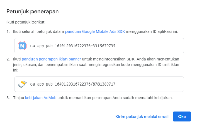

| Versi | Ditulis Pada | Penulis |
|-------|----|-----|
| 1.0 | *Juni 2024* sampai *Agustus 2024* | [Kang Cahya](https://github.com/dyazincahya) |

# BAB IX : MEMONETISASI APLIKASI


Meski di tempat Anda bekerja NativeScript bukan bagian dari Stack yang digunakan, Anda tetap bisa memanfaatkannya untuk mengerjakan pekerjaan sampingan, seperti membuat aplikasi di luar kantor jika ada tawaran. Anda juga dapat mengembangkan proyek aplikasi mandiri dan mempublikasikannya di Google Play Store. Untuk mendapatkan penghasilan dari Play Store, Anda bisa menjual aplikasi tersebut sebagai aplikasi premium atau melakukan Monetisasi iklan dengan mendaftarkan aplikasi Anda ke Google AdMob dan mulai menayangkan iklan pada aplikasi yang Anda buat.

**9.1 AdMob**

AdMob merupakan platform periklanan milik Google yang memungkinkan pengembang aplikasi Mobile untuk menghasilkan pendapatan dengan menampilkan iklan di dalam aplikasi mereka. AdMob menawarkan berbagai format iklan yang dapat disesuaikan dengan tata letak dan tujuan aplikasi, seperti Banner, Interstitial, Native, dan Rewarded Ad.

**9.1.1 Banner Ad**

Iklan Banner adalah iklan berbentuk persegi panjang yang muncul di bagian atas atau bawah layar aplikasi. Ukuran Banner dapat bervariasi, dan biasanya tetap terlihat saat pengguna menavigasi aplikasi. Iklan Banner ideal untuk menampilkan iklan secara terus-menerus tanpa mengganggu pengalaman pengguna. Banner sering digunakan pada aplikasi dengan antarmuka pengguna yang sederhana dan tetap. 

Kelebihan:

- Tidak mengganggu pengalaman pengguna dan; 
- Dapat berjalan terus menerus di latar belakang aplikasi. 

Kekurangan:

- Pendapatan per klik (CPC) biasanya lebih rendah dibandingkan dengan format iklan lainnya.
- Serta ruang iklan yang terbatas sehingga kurang menarik untuk beberapa jenis iklan.

**9.1.2 Interstitial Ad**

Iklan Interstitial adalah iklan yang ditampilkan secara fullscreen dan menutupi seluruh antarmuka aplikasi. Iklan ini muncul pada transisi alami dalam aplikasi, seperti saat berpindah dari satu halaman ke halaman lainnya, dan biasanya digunakan untuk menarik perhatian pengguna secara penuh. 

Kelebihan:

- Tingkat Engagement yang sangat tinggi karena iklan menutupi layar secara penuh.
- Serta memiliki potensi pendapatan yang lebih tinggi dibandingkan dengan Iklan Banner.

Kekurangan:

- Iklan ini bisa mengganggu pengguna jika tidak ditampilkan pada waktu yang tepat.
- Pengguna mungkin meninggalkan aplikasi jika iklan ini digunakan terlalu sering.

**9.1.3 Native Ad**

Iklan Native adalah iklan yang dirancang agar sesuai dengan tampilan dan nuansa aplikasi Anda sendiri, sehingga pengguna tidak akan merasa seperti iklan. Native Ad bisa disesuaikan agar terlihat seperti konten organik dalam aplikasi Anda. Iklan ini dapat digunakan untuk integrasi iklan yang lebih halus dan tidak mengganggu dalam aplikasi. Iklan ini sering digunakan di aplikasi yang menampilkan banyak konten, seperti aplikasi berita atau media sosial.

Kelebihan:

- Memberikan pengalaman pengguna yang lebih baik karena iklan menyatu dengan konten aplikasi.
- Memiliki potensi CTR (Click-Through Rate) yang lebih tinggi karena tampilan iklan terlihat lebih alami, sehingga pengguna tidak merasa terlalu terganggu dan mungkin tidak langsung menyadari bahwa itu adalah iklan.

Kekurangan:

- Memerlukan upaya tambahan untuk desain dan implementasi agar iklan benar-benar menyatu dengan aplikasi.
- Bisa kurang efektif jika tidak diintegrasikan dengan baik.

**9.1.4 Rewarded Ad**

Iklan Rewarded adalah iklan video atau Interstitial yang menawarkan hadiah kepada pengguna setelah mereka menonton iklan sepenuhnya. Pengguna biasanya mendapatkan hadiah dalam bentuk item dalam aplikasi, seperti koin, nyawa tambahan, atau akses ke konten premium. Iklan ini cocok digunakan untuk aplikasi permainan atau aplikasi lain yang menawarkan nilai tambah untuk pengguna. Iklan ini memberikan insentif kepada pengguna untuk berinteraksi dengan iklan.

Kelebihan:

- Tingkat Engagement yang sangat tinggi karena pengguna mendapatkan imbalan setelah menonton iklan.
- Pengguna lebih mungkin menyelesaikan menonton iklan karena adanya insentif berupa hadiah atau imbalan lainnya.

Kekurangan:

- Mungkin tidak cocok untuk semua jenis aplikasi, terutama jika tidak ada cara yang relevan untuk memberikan hadiah.
- Mirip seperti Interstitial, iklan ini bisa terasa seperti gangguan jika diterapkan terlalu sering atau di tempat yang tidak relevan.

2. **Implementasi AdMob**

Untuk mendapatkan penghasilan dari aplikasi yang dipublikasikan di Google Play Store, NativeScript memungkinkan Anda untuk Memonetisasi aplikasi dengan iklan dari Google AdMob. NativeScript sudah menyediakan plugin yang dapat membantu memudahkan Anda untuk menyematkan iklan dari Google AdMob di aplikasi. Anda dapat menggunakan plugin *@nativescript/firebase-core* dan *@nativescript/firebase-admob*.

**9.2.1 Persiapan**

Sebelum mulai mengimplementasikan AdMob di aplikasi Anda, ada beberapa hal yang harus Anda lakukan, yaitu:

1. Buat akun Google AdMob terlebih dahulu di <https://admob.google.com>. 
1. Setelah akun berhasil dibuat, tambahkan aplikasi Anda yang sudah dipublikasikan di Google Play Store ke dalam Google AdMob.
1. Buat akun Google Firebase, dan tambahkan aplikasi Anda di sana. Tujuannya adalah untuk mendapatkan file *google-services.json*. File ini bersifat unik; setiap aplikasi memiliki satu file yang berbeda. Unduh file *google-services.json* kemudian letakan di *NS\_PROJECT/App\_Resources/Android/src*.
1. Pastikan juga untuk menautkan setiap aplikasi yang sudah ditambahkan ke Google AdMob ke Google Firebase agar Anda dapat memanfaatkan fitur analitik dan pelacakan performa iklan dengan lebih efektif. Caranya Anda bisa masuk ke halaman pengaturan yang ada di setiap Aplikasi.
1. Yang terakhir tambahkan Unit Iklan baru untuk mendapatkan ID Aplikasi dan ID Unit Iklan dari Google AdMob, contoh ID-Nya kurang lebih seperti ini.



***Gambar 9.1 ID Aplikasi dan ID Unit Iklan***

Pada tahap ini, saya akan mengasumsikan bahwa Anda sudah memiliki akun Google AdMob, sudah menambahkan aplikasi Anda ke sana, serta sudah membuat Unit Iklan dan mendapatkan ID Aplikasi serta ID Unit Iklan.

**9.2.2 Pemasangan dan Konfigurasi Plugin**

Ada beberapa tahap pemasangan dan konfigurasi plugin yang bisa Anda lakukan sebelum mulai menyematkan iklan AdMob di aplikasi Anda. Tahap-tahap tersebut antara lain:

- Pasang Plugin Nativescript AdMob

Sebelum memasang Plugin Nativescript AdMob, Anda harus memasang Plugin *@nativescript/firebase-core* terlebih dahulu. Plugin ini merupakan inti dari plugin Firebase yang ada di NativeScript, dengan sekitar 17 plugin yang tersedia. Salah satu dari plugin tersebut adalah plugin AdMob. Ketika Anda ingin memasang salah satu plugin Firebase tersebut, Anda diwajibkan memasang *@nativescript/firebase-core* terlebih dahulu. Anda dapat melihatnya di sini <https://docs.nativescript.org/plugins/firebase-core>. 

Jalankan perintah berikut untuk memasang Plugin Firebase Core:

```bash
ns plugin install @nativescript/firebase-core
```

Setelah Plugin Firebase Core di pasang, lanjut jalankan perintah berikut untuk memasang plugin AdMob:

```bash
ns plugin install @nativescript/firebase-admob
```

- Konfigurasi AndroidManifest.xml

Ada beberapa hal yang perlu Anda tambahkan pada file *AndroidManifest.xml* yang ada di *NS\_PROJECT/App\_Resources/Android/src/main*.

Tambahkan kode berikut di dalam tag *<application>* pada file *AndroidManifest.xml.* Masukkan ID Aplikasi yang Anda dapatkan dari Google AdMob saat Anda menambahkan aplikasi Anda ke sana:

```xml
<meta-data
      android:name="com.google.android.gms.ads.APPLICATION_ID"
      android:value=" YOUR_ADMOB_APP_ID "
    />
```

Tambahkan Permission berikut di dalam tag <manifest>, jika belum ada:

```xml
<uses-permission android:name="android.permission.INTERNET" />
<uses-permission android:name="android.permission.ACCESS_NETWORK_STATE" />
```

Tambahkan juga Permission Ad agar aplikasi Anda dapat berjalan pada perangkat dengan Android 13 atau versi yang lebih baru. Android 13 dan versi yang lebih baru mewajibkan penambahan izin ini:

```xml
<uses-permission android:name="com.google.android.gms.permission.AD_ID" />
```

- Inisialisasi Plugin Nativescript AdMob

Untuk menginisialisasi plugin AdMob, Anda dapat menambahkan kode berikut pada file *app.js* yang ada di *NS\_PROJECT/app*.

```javascript
import { firebase } from "@nativescript/firebase-core";
import { Admob } from "@nativescript/firebase-admob";

await firebase().initializeApp();
Admob.init();
```

**9.2.3 Menyematkan Iklan dari Google AdMob**

Setelah semua persiapan, pemasangan, dan konfigurasi plugin selesai dilakukan, Anda dapat mulai menyematkan iklan dari Google AdMob ke tiap halaman di Aplikasi Anda. Ada empat jenis iklan yang dapat Anda pasang sesuai kebutuhan: Banner, Interstitial, Native, dan Rewarded. Berikut adalah contoh kode untuk menyematkan iklan tersebut.

- Banner Ad

Tambahkan atribut berikut pada tag <Page> pada file tampilan XML Anda.

```
xmlns:ui="@nativescript/firebase-admob"
```

Kemudian untuk menyematkan iklan-Nya, Anda dapat menggunakan kode berikut, sesuaikan ID Unit Iklan dengan ID milik Anda.

```xml
<ui:BannerAd
  height="50"
  width="320"
  unitId="YOUR_ADMOB_UNIT_ID"
  layoutChanged="bannerAdLoaded" />
```

Kurang lebih seperti ini contoh kode lengkap XML dan Javascript-Nya.

```xml
<!-- Kode XML -->

<Page 
  xmlns="http://schemas.nativescript.org/tns.xsd" 
  xmlns:ui="@nativescript/firebase-admob"
  navigatingTo="onNavigatingTo">
  <ActionBar title="MyApp" />

  <GridLayout>
    <ui:BannerAd
      height="50"
      width="320"
      unitId="ca-app-pub-1640120316722376/8781389717"
      layoutChanged="bannerAdLoaded" />
  </GridLayout>
</Page>
```

```javascript
/* Kode Javascript */

import { Observable } from "@nativescript/core";
import { BannerAdSize } from "@nativescript/firebase-admob";

const context = new Observable();
export function onNavigatingTo(args) {
  const page = args.object;
  page.bindingContext = context;
}

export function bannerAdLoaded(args) {
  const banner = args.object;
  const adSize = new BannerAdSize(320, 50);
  banner.size = adSize;
  banner.load();
}
```

- Interstitial Ad

Untuk menyematkan Iklan Interstitial cukup sederhana, Anda cukup membuat sebuah satu fungsi seperti ini, kemudian fungsi tersebut Anda dapat panggil jika ingin menampilkan Iklan. Kurang lebih seperti ini contoh kode-Nya.

```javascript
import { InterstitialAd } from "@nativescript/firebase-admob";

export function loadInterstisialAd() {
  const ad = InterstitialAd.createForAdRequest(
    "YOUR_ADMOB_UNIT_ID"
  );

  ad.onAdEvent((event, error, data) => {
    ad.show({
      immersiveModeEnabled: true,
    });
  });

  ad.load();
}
```

- Native Ad

Berikut adalah contoh kode Native Ad untuk file XML-Nya.

```xml
<Page 
  xmlns="http://schemas.nativescript.org/tns.xsd" 
  xmlns:ui="@nativescript/firebase-admob"
  navigatingTo="onNavigatingTo">
  <ActionBar title="MyApp" />

  <GridLayout>
    <ui:NativeAdView height="400" loaded="nativeAdLoaded">
      <GridLayout height="300" width="100%">
        <Label id="headLineView" />
        <ui:MediaView id="mediaView" height="100%"/>
        <Label id="bodyView" />
        <Button id="callToActionView" />
      </GridLayout>
    </ui:NativeAdView>
  </GridLayout>
</Page>
```

Berikut adalah contoh kode untuk file Javascript-Nya.

```javascript
import { 
  NativeAdLoader, 
  AdChoicesPlacement,
  NativeAdEventType
} from "@nativescript/firebase-admob";

export function nativeAdLoaded(args) {
  const view = args.object;

  const loader = new NativeAdLoader(
    "YOUR_ADMOB_UNIT_ID",
    null,
    {
      nativeAdOptions: {
        adChoicesPlacement: AdChoicesPlacement.TOP_RIGHT,
      },
    }
  );

  loader.onAdEvent((event, error, data) => {
    if (event === NativeAdEventType.LOADED) {
      const ad = data;

      const headLineView = view.getViewById("headLineView");
      headLineView.text = ad.headline;
      const mediaView = view.getViewById("mediaView");
      view.mediaView = mediaView;
      mediaView.mediaContent = ad.mediaContent;
      const callToActionButton = view.getViewById("callToActionView");
      view.callToActionView = callToActionButton;
      callToActionButton.text = ad.callToAction;
      const bodyView = view.getViewById("bodyView");
      bodyView.text = ad.body;
      view.nativeAd = ad;
      console.log("nativead loaded");
    } else if (event === "adFailedToLoad") {
      console.log("nativead failed to load", error);
    }
  });

  loader.load();
}
```

- Rewarded Ad

Untuk menyematkan Iklan Rewarded kurang lebih sederhana seperti pada Iklan Interstitial. Anda dapat menampungnya dalam satu fungsi, kemudian fungsi tersebut Anda dapat panggil jika ingin menampilkan Iklan-Nya. Kurang lebih seperti ini contoh kode-Nya.

```javascript
import { RewardedAd } from "@nativescript/firebase-admob";

export function loadRewardedAd() {
  const ad = RewardedAd.createForAdRequest(
    "YOUR_ADMOB_UNIT_ID"
  );

  ad.onAdEvent((event, error, data) => {
    ad.show({
      immersiveModeEnabled: true,
    });
  });

  ad.load();
}
```

**9.3 Ringkasan**

Terdapat empat tipe iklan yang Anda dapat gunakan, tempatkan iklan sesuai fungsinya dan dengan porsi yang tidak berlebihan. Penempatan iklan yang berlebihan dalam aplikasi bisa berdampak negatif baik bagi pengalaman pengguna maupun terhadap keberlanjutan aplikasi di platform distribusi seperti Google Play Store. 

Menjaga keseimbangan antara Monetisasi melalui iklan dan pengalaman pengguna yang positif sangat penting untuk kesuksesan jangka panjang aplikasi Anda. Penempatan iklan yang bijak dan strategis akan membantu menghindari dampak buruk ini, memastikan aplikasi Anda tetap populer dan berkelanjutan.

