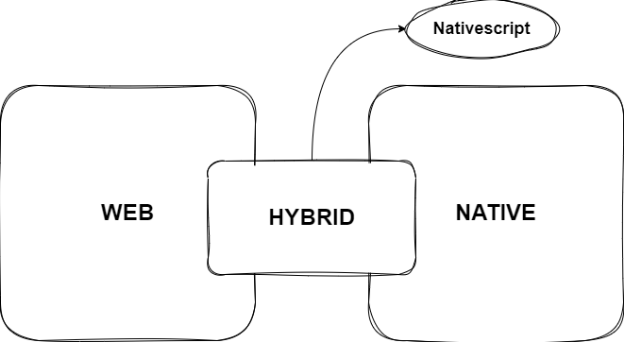
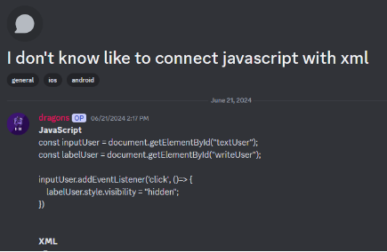
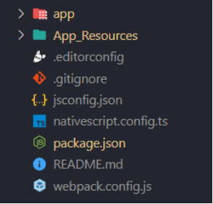
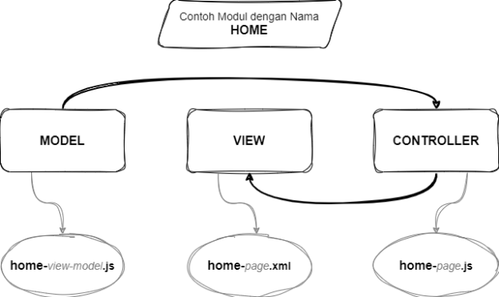

| Versi | Ditulis Pada | Penulis |
|-------|----|-----|
| 1.0 | *Juni 2024* sampai *Agustus 2024* | [Kang Cahya](https://github.com/dyazincahya) |

# BAB V : KONSEP DASAR




***Gambar 5.1 Posisi Nativescript***

Posisi Nativescript sebagai sebuah Framework Hybrid, memungkinkan Anda sebagai pengembang menggunakan fasilitas dari Teknologi Web dan Native sekaligus. Untuk melakukan Styling pada aplikasi, Anda dapat menggunakan CSS atau SCSS, juga menggunakan Javascript. Dari sisi tampilan Anda dapat menggunakan komponen  UI yang di tulis dalam bentuk XML, selain itu Anda juga dapat mengakses API Native yang tersedia secara langsung. Sebagai ilustrasi Anda dapat melihat gambar di atas.

Anda dapat menggunakan Javascript di Nativescript,  namun yang perlu Anda tahu, walau menggunakan Javascript, Nativescript mempunyai aturannya sendiri, tidak bisa Anda membawa konsep Javascript di web secara utuh di Nativescript. Karena pada dasarnya Nativescript itu adalah sebuah Kerangka Kerja (Framework), tentunya Nativescript punya konsep sendiri di bandingkan dengan Javascript Web pada umumnya. Hal tersebut akan terasa saat Anda akan melakukan Binding Data, yaitu sebuah proses melempar data dari Javascript ke XML. Terjadi juga pada bagian XML, sekilas kode XML yang di tulis atributnya seperti sama dengan saat kita menulis HTML biasa, namun itu XML bukanlah HTML, saya beberapa kali melihat kasus di komunitas Nativescript di Discord yang mengeluhkan kenapa kode yang iya tulis mengalami Error, kurang lebih pertanyaannya seperti ini.



***Gambar 5.2 Salah satu pertanyaan dari komunitas Nativescript di Discord***


Intinya ia mencoba menanyakan cara menghubungkan Javascript dengan XML, kurang lebih kode yang ia buat seperti di bawah ini

```javascript
// KODE JAVASCRIPT-NYA

const inputUser = document.getElementById("textUser");
const labelUser = document.getElementById("writeUser");
 
inputUser.addEventListener('click', ()=> {
    labelUser.style.visibility = "hidden";
})
```

Pada kode Javascript di atas, ia mencoba untuk membuat sebuah kode Javascript Event Click, yang harapannya saat Elemen yang memiliki ID textUser di klik, maka Elemen yang memiliki ID writeUser itu hilang dengan cara mengatur value Style Visibility-Nya menjadi Hidden.

Kode Javascript di atas tidaklah salah jika di lihat dari sudut pandang Javascript di Web, namun kode tersebut di dikatakan salah jika di lihat dari sudut pandang Javascript di  Nativescript, seperti yang sudah saya katakan sebelumnya, *Nativescript memang menggunakan Javascript, tapi Anda tidak bisa membawa konsep Javascript secara utuh ke Nativescript*. Jika saya coba untuk memperbaiki kode di atas, kurang lebih hasilnya seperti ini.

```javascript
// KODE JAVASCRIPT YANG SUDAH DIPERBAIKI

import { Observable } from "@nativescript/core";
 
var context = new Observable();
 
export function onNavigatingTo(args) {
  const page = args.object;
  context.set("isLabelVisible", true);
  page.bindingContext = context;
}
 
export function onFocusInputUser() {
  context.set("isLabelVisible", false);
}
```

```xml
<!-- KODE XML YANG SUDAH DIPERBAIKI -->

<Page
    navigatingTo="onNavigatingTo"
    xmlns="http://schemas.nativescript.org/tns.xsd">
    <ActionBar title="MyApp" />
    <StackLayout> 
        <Label text="User" textWrap="true" visibility="{{ isLabelVisible ? 'visible' : 'collapsed' }}" />
        <TextField hint="Write user..." focus="onFocusInputUser" />
    </StackLayout> 
</Page>
```


**5.1 Struktur Folder**



***Gambar 5.3 Struktur Folder***


Saat Anda pertama kali membuat proyek baru di Nativescript, kurang lebih folder yang akan Anda dapat yakni seperti yang ada pada gambar di atas, berikut adalah struktur folder secara rincinya.

- ***app,*** folder ini berisi File proyek di mana tempat Anda bekerja menulis kode.
  - ***\_app-common.scss,*** ini adalah file global untuk melakukan styling, saat Anda menuliskan kode css pada file ini, maka akan diterapkan pada Platform Android dan IOS. Biasanya untuk proyek yang menggunakan *Blank Template* atau proyek yang tidak menggunakan template akan berekstensi (.css) bukan (.scss).
  - ***app.android.scss,*** ini adalah file spesifik untuk melakukan styling pada Platform Android, saat Anda menulis kode css pada file ini, maka hanya akan di terapkan pada Platform Android saja.
  - ***app.ios.scss,*** ini adalah file spesifik untuk melakukan styling pada Platform IOS, saat Anda menulis kode css pada file ini, maka hanya akan di terapkan pada Platform IOS saja.
  - ***app.js,*** ini adalah file utama yang akan di eksekusi pertama kali, jika pada aplikasi Web file *app.js* ini adalah *index.html* atau *index.php* Nya.
  - ***fonts,*** ini adalah folder untuk menyimpan file *Font Type* atau *Font Icon* seperti *Fontawesome Icon*, *Material Symbol* dan lain-lain. 
  - ***File atau Folder lainnya,*** biasanya jika Anda membuat proyek baru menggunakan Template, maka Anda akan menemukan contoh kode bawaan dari Template-Nya.
- ***App\_Resources,*** folder ini berisi sumber daya aplikasi dari masing-masing platform seperti ikon, file konfigurasi, kode Native, dan lain-lain.
  - ***Android,*** semua sumber daya untuk aplikasi Android disimpan di dalam folder ini. 
    - ***app.gradle,*** pada file ini berisi semua konfigurasi aplikasi Android Anda, seperti mengatur minimum, target dan compile SDK Version,  juga dependencies  dari bahasa Native juga di letakan di sini.
    - ***before-plugins.gradle,*** file ini digunakan untuk mendefinisikan properti tambahan seperti *dependencies version*.
    - ***src\main\res,*** folder ini berisi semua resource Android, seperti ikon aplikasi, gambar splash screen dan konfigurasi lainnya.
    - ***src\main\AndroidManifest.xml,*** merupakan sebuah file XML yang berisi informasi tentang aplikasi Android seperti Permission, Screen Orientation, dan lain-lain.
  - ***IOS,*** semua sumber daya untuk aplikasi IOS disimpan di dalam folder ini. Untuk IOS sendiri saya tidak begitu membahasnya secara rinci, karena saya sendiri kurang familiar dengan Platform satu ini, saat ini saya hanya berfokus pada aplikasi Android.
- ***platforms,*** pada folder ini berisi file hasil Build, seperti file aplikasi .apk, .aab atau yang lainnya. 
- ***nativescript.config.ts,*** file ini berisi konfigurasi dari nativescript, seperti ID Aplikasi, dan lain-lain.
- ***webpack.config.js,*** file ini berisi konfigurasi dari webpack, Anda dapat melakukan optimasi pada aplikasi Nativescript Anda dengan menggunakan Webpack.
- ***File atau Folder lainnya,*** jika ada file atau folder yang tidak di paparkan di sini, kemungkinan itu adalah file yang umum ada di setiap proyek aplikasi, contohnya seperti .editorconfig, .gitignore, README.md, package.json, .vscode, node\_modules dan lain-lain.

**5.2 Style Sheets**

Untuk melakukan styling tampilan aplikasi Anda dapat menggunakan kode CSS, namun ada sedikit perbedaan saat Anda akan menuliskan kode CSS di web dan di Nativescript. Anda bisa coba bedakan apa perbedaan dari kode di bawah ini?

```css
// CSS di web
.header {
    font-size: 18px;
}

// CSS di nativescript
.header { 
    font-size: 18;
}
```

Jika Anda perhatikan kode di atas, kode CSS di Nativescript tidak menggunakan satuan ukuran, dalam contoh di atas yakni Pixel (px). Saat menulis kode CSS di Nativescript, Anda tidak perlu mendefinisikan satuan ukuran, semua ukuran yang di definisikan pada CSS akan di hitung dalam ukuran Pixel (px), ketika Anda mendefinisikan font-size=16, itu artinya font-size=16px. 

Jika ada kasus seperti ini, misalkan Anda ingin mengatur sebuah ukuran yang mana Anda ingin mengatur ukurannya berukuran 1rem, maka yang harus Anda coba lakukan yaitu mengonversi satuan rem tersebut ke pixel, yakni 1rem = 16px, jadi pada kode CSS, Anda tinggal definisikan ukurannya sebesar 16.

Selain itu Anda juga dapat membuat sebuah Animasi dengan menggunakan CSS yang didasarkan pada standar API animasi di CSS3. Contohnya sebagai berikut.

```css
@keyframes bounce {
  0%,
  20%,
  50%,
  80%,
  100% {
    transform: translateY(0);
  }
  40% {
    transform: translateY(-10);
  }
  60% {
    transform: translateY(-5);
  }
}
 
.bounce {
  animation-duration: 2s;
  animation-timing-function: ease;
  animation-iteration-count: infinite;
  animation-name: bounce;
}
```

Kode CSS di atas merupakan sebuah CSS untuk membuat sebuah animasi bounce, objek akan memantul ke atas dan ke bawah, begitu seterusnya. Anda juga dapat mengeksplorasi bentuk animasi-animasi lainnya dengan bebas.

**5.3 Binding Data**

Binding data adalah sebuah kunci di Nativescript, yang mana ini adalah konsep dasar yang perlu Anda pahami. Ini adalah sebuah proses mengalirkan data dari Model ke antarmuka aplikasi (UI), kurang lebih prosesnya sama seperti konsep MVC, di mana dalam 1 modul akan berisi 3 File, namun pada praktiknya saya lebih suka menyatukan proses Model dan Controller dalam 1 File, jadi dalam 1 modul biasanya hanya terdiri dari 2 File saja.


***Gambar 5.4 Konsep MVC dan Penamaan File modul di Nativescript***


Sebenarnya dari Nativescript sendiri tidak pernah menyebut istilah MVC pada laman dokumentasinya, itu hanya ilustrasi dari saya pribadi agar Anda lebih mudah memahaminya, karena memang pada praktiknya proses Binding Data ini dari segi alur mirip seperti konsep MVC.

*Untuk membuat modul baru, penamaan File JS Controller dan XML View harus sama, seperti yang Anda lihat pada gambar di atas. Untuk penamaan File Model sebaiknya menggunakan nama modul sebagai Prefix agar terlihat seragam.*

Binding Data di Nativescript terbagi menjadi 2, yaitu Binding Data Object dan Binding Data Array. Untuk Binding Data Objek Anda bisa menggunakan Observable dan untuk Binding Data Array Anda bisa menggunakan ObservableArray.

**5.3.1 Observable**

Observable merupakan sebuah elemen dasar di seluruh *@nativescript/core*. Observable memainkan peran penting dalam hal Binding Data di NativeScript. Ini berfungsi sebagai komponen kunci untuk menghubungkan antarmuka aplikasi (UI) dengan data pokok yang ada di dalam model.

Sederhananya Observable memungkinkan Anda untuk menyinkronkan dan memperbarui elemen UI aplikasi Anda dengan perubahan pada data yang terjadi di model. Observable bertindak sebagai jembatan yang memberi tahu UI setiap kali ada modifikasi pada data, memastikan bahwa UI tetap sinkron dengan data terbaru.

```javascript
/* FILE : home-view-model.js */
 
import { Observable } from "@nativescript/core";
 
export function createViewModel() {
  const viewModel = new Observable();
  viewModel.myName = "Kang Cahya";
 
  return viewModel;
}
```

```javascript
/* FILE : home-page.js */
 
import { createViewModel } from "./home-view-model";
 
export function onNavigatingTo(args) {
  const page = args.object;
  page.bindingContext = createViewModel();
}
```

```xml
<!-- FILE : home-ppage.xml  -->
 
<Page xmlns="http://schemas.nativescript.org/tns.xsd" navigatingTo="onNavigatingTo">
  <ActionBar title="My App" />
  <StackLayout>
    <Label text="{{ myName }}" textWrap="true" />
  </StackLayout>
</Page>
```

Pada kode di atas adalah sebuah contoh sederhana bagaimana cara melakukan Binding Data di Nativescript menggunakan Observable.

- Pada file ***home-view-model.js** (Model)* Anda dapat melihat, mula-mula saya mencoba mendefinisikan dahulu Constructor Observable, kemudian saya membuat Object Variabel dengan nama *myName* yang saya sematkan pada Constructor Observable.
- Lalu pada file ***home-page.js*** *(Controller)* saya menyematkan model pada *bindingContext* yang berada di dalam fungsi onNavigatingTo, fungsi tersebut akan di panggil pada file *home-page.xml*. Jika model sudah di sematkan pada *bindingContext*, maka semua Object Variabel yang ada di dalam model akan dapat di panggil dari View.
- Pada file ***home-page.xml** (View)* Anda dapat langsung mengakses setiap Object Variabel yang ada di model. Di dalam View terdapat atribut *navigatingTo*, ini adalah tempat untuk mendefinisikan fungsi yang ingin di eksekusi pertama kali sebelum UI tampil. Jika di Web, misalnya di JQuery, *navigatingTo* ini kurang lebih sama seperti *$( document ).ready()*. Sebenarnya ada 2 atribut yang akan di eksekusi sebelum UI tampil, yaitu *loaded*, kemudian *navigatingTo* akan di eksekusi setelah *loaded* selesai di eksekusi.

Di atas adalah contoh normal proses Binding Data dengan menggunakan konsep MVC. Namun sebenarnya Anda dapat membuatnya lebih sederhana dengan menyatukan proses model dan controller menjadi satu, cara ini boleh di pakai, tidak ada larangan, karena saya sendiri sering menggunakan cara yang satu ini, namun cara ini tidak di rekomendasikan, karena akan terlihat berantakan jika kode program yang Anda buat sudah terlalu banyak dan besar. Kurang lebih seperti ini contoh kode-Nya.

```javascript
/* FILE : home-page.js */
 
import { Observable } from "@nativescript/core"; 
 
const context = new Observable();
 
export function onNavigatingTo(args) { 
  const page = args.object; 
  context.set("myBlog", "kang-cahya.com");
  page.bindingContext = context; 
}
```

```xml
<!-- FILE : home-ppage.xml  --> 
 
<Page xmlns="http://schemas.nativescript.org/tns.xsd" navigatingTo="onNavigatingTo"> 
  <ActionBar title="My App" /> 
  <StackLayout> 
    <Label text="{{ myBlog }}" textWrap="true" /> 
  </StackLayout> 
</Page>
```

**5.3.2 ObservableArray**

ObservableArray ini mirip seperti Observable, perbedaan dari keduanya ialah bentuk datanya, jika Observable itu datanya berbentuk object dan ObservableArray datanya berbentuk Array. ObservableArray biasanya digunakan untuk data berupa List. Kurang lebih seperti ini contoh kode-Nya.

```javascript
/* FILE : home-page.js */ 

import { ObservableArray } from "@nativescript/core";  
 
const context = new ObservableArray(); 
 
export function onNavigatingTo(args) {  
  const page = args.object;  
  context.set("animals", [
    { name: "angsa" },
    { name: "bebek" },
    { name: "ayam" },
  ]); 
  page.bindingContext = context;  
}
```

```xml
<!-- FILE : home-ppage.xml  -->  
 
<Page xmlns="http://schemas.nativescript.org/tns.xsd" navigatingTo="onNavigatingTo">
  <ActionBar title="My App" />  
  <StackLayout>  
    <ListView items="{{ animals }}">
      <ListView.itemTemplate>
        <GridLayout padding="16">
          <Label text="{{ name }}" textWrap="true" />
        </GridLayout>
      </ListView.itemTemplate>
    </ListView> 
  </StackLayout>
</Page>
```

Untuk menampilan sebuah data berbentuk Array, Anda dapat menggunakan komponen ListView dari Nativescript.

**5.4 API yang umum digunakan**

Ada banyak API yang dapat Anda gunakan di Nativescript, semuanya ada di dalam Package *@nativescript/core.* Namun semua API yang tersedia belum tentu Anda butuh kan, maka dari itu saya akan coba membahas API yang umum dan kemungkinan banyak pengembang butuh kan, di antaranya sebagai berikut.

**5.4.1 Application**

```javascript
import { Application } from '@nativescript/core'
```


Application merupakan sebuah Wrapper dari *android.app.Application* untuk Android dan *UIApplication* untuk iOS. Dengan ini Anda dapat bebas mengakses API Native yang ada di dalamnya. Untuk mengetahui API Native apa saja yang tersedia Anda dapat mengunjungi laman atau mencarinya langsung di mesin pencarian menggunakan kata kunci berikut :

` `***android.app.Application***

<https://developer.android.com/reference/android/app/Application>

***UIApplication***

<https://developer.apple.com/documentation/uikit/uiapplication>

Untuk contoh penggunaan dari *Application Class* Anda dapat melihatnya di BAB I bagian *Show Toast Android (Java).*

**5.4.2 ApplicationSettings**

```javascript
import { ApplicationSettings } from '@nativescript/core'
```


Class ini berfungsi untuk menyimpan data di dalam Storage Device. Class ini biasanya digunakan untuk menyimpan data pengaturan dari aplikasi yang kita buat, tapi tidak menutup kemungkinan di gunakan untuk menyimpan data yang lain. Data yang dapat disimpan menggunakan Class ini meliputi data String, Boolean dan Number. 

1. **Data String**

Berikut adalah contoh kode untuk menyimpan dan mengambil Data String.

```javascript
// FORMAT
// Menyimpan data string
ApplicationSettings.setString(key: string, value: string)
 
// Mendapatkan data string
ApplicationSettings.getString(key: string)
 
// Mendapatkan data string dengan default value jika key tidak ditemukan  
ApplicationSettings.getString(key: string, deafaultValue?: string)
 
// CONTOH
ApplicationSettings.setString("bahasa", "indonesia")
let bahasa = ApplicationSettings.getString("bahasa")
console.log(bahasa) // Result : indonesia
```

2. **Data Number**

Berikut adalah contoh kode untuk menyimpan dan mengambil Data Number.

```javascript
// FORMAT
// Menyimpan data number
ApplicationSettings.setNumber(key: string, value: number)
 
// Mendapatkan data number
ApplicationSettings.getNumber(key: string)
 
// Mendapatkan data number dengan default value jika key tidak ditemukan  
ApplicationSettings.getNumber(key: string, deafaultValue?: number)
 
// CONTOH
ApplicationSettings.setNumber("tahunKemerdekaan", 1945)
let tahunKemerdekaan = ApplicationSettings.getNumber("tahunKemerdekaan")
console.log(tahunKemerdekaan) // Result : 1945
```

3. **Data Boolean**

Berikut adalah contoh kode untuk menyimpan dan mengambil Data Boolean.

```javascript
// FORMAT
// Menyimpan data boolean
ApplicationSettings.setBoolean(key: string, value: boolean)
 
// Mendapatkan data boolean
ApplicationSettings.getBoolean(key: string)
 
// Mendapatkan data boolean dengan default value jika key tidak ditemukan  
ApplicationSettings.getBoolean(key: string, deafaultValue?: boolean)
 
// CONTOH
ApplicationSettings.setBoolean("notifikasi", true)
let notifikasi = ApplicationSettings.getBoolean("notifikasi")
console.log(notifikasi) // Result : true
```

4. **remove()**

Anda juga dapat menghapus data yang memang sudah tidak di butuh kan menggunakan Method Remove ini.

```javascript
// FORMAT
ApplicationSettings.remove(key: string)

// CONTOH
ApplicationSettings.remove(“tahunKemerdekaan”)
```

5. **clear()**

Untuk menghapus data secara spesifik berdasarkan Key, Anda bisa menggunakan Method Remove di atas, namun Anda juga bisa menghapus semua data sekaligus menggunakan Method Clear.

```javascript
ApplicationSettings.clear()
```

6. **hasKey()**

Method ini berfungsi untuk mengecek apakah key data yang Anda maksud ada atau tidak.

```javascript
let check = ApplicationSettings.hasKey("tahunKemerdekaan")
if(check){
  console.log("Ada")
} else {
  console.log("Tidak Ada")
}
```

7. **getAllKeys()**

Method ini berfungsi untuk menampilkan semua key yang tersimpan pada Storage Device, return dari method ini berupa Array String.

```javascript
// CONTOH
ApplicationSettings.getAllKeys()
 
// HASIL
// ["notifikasi", "tahunKemerdekaan", "bahasa"]
```

Sebenarnya Anda dapat menyimpan data Array atau pun Object menggunakan ApplicationSettings Class ini, namun saat menyimpan, Anda harus mengonversi data tersebut menjadi String dahulu menggunakan fungsi *JSON.stringify().* Jika Anda ada kebutuhan untuk menyimpan data dalam bentuk Object atau Array, untuk mempermudah, Anda bisa menggunakan Helper yang saya buat, Helper ini merupakan sebuah *Wrapper* dari *ApplicationSettings Class* <https://github.com/dyazincahya/local-storage-array-nativescript.>

**5.4.3 Connectivity**

```javascript
import { Connectivity } from '@nativescript/core'
```


Class ini berfungsi untuk mengecek atau mendeteksi koneksi apa yang sedang digunakan, apakah sedang Online atau pun Offline.

```javascript
const connectionType = Connectivity.getConnectionType();
switch (connectionType) {
  case Connectivity.connectionType.wifi:
    console.log("Konek dengan Wifi");
    break;
  case Connectivity.connectionType.ethernet:
    console.log("Konek dengan Ethernet");
    break;
  case Connectivity.connectionType.mobile:
    console.log("Konek dengan Mobile Data");
    break;
  case Connectivity.connectionType.bluetooth:
    console.log("Konek dengan Bluetooth");
    break;
  case Connectivity.connectionType.vpn:
    console.log("Konek dengan VPN");
    break;
  default:
    console.log("Offline");
    break;
}
```

**5.4.4 Device**

```javascript
import { Device } from '@nativescript/core'
```


Class ini berfungsi untuk mengetahui informasi tentang perangkat saat ini, data yang akan Anda dapat meliputi os yang digunakan, bahasa, produsen, uuid, dan lainnya.

```javascript
// Mendapatkan jenis perangkat saat ini
// Jenis yang tersedia: "Telepon" | "Tablet"
const deviceType = Device.deviceType // Phone
 
// Mendapatkan bahasa perangkat
const language = Device.language // "en"
 
// Mendapatkan produsen perangkat
const manufacturer = Device.manufacturer // "Samsung"
 
// Mendapatkan model perangkat
const model = Device.model // "SM-A415F"
 
// Mendapatkan OS perangkat
const os = Device.os // Android
 
// Mendapatkan versi OS
const osVersion = Device.osVersion // 13
 
// Mendapatkan wilayah/negara perangkat
const region = Device.region // ID
 
// Mendapatkan versi SDK
const sdkVersion = Device.sdkVersion // 33
 
// Mendapatkan uuid perangkat
const uuid = Device.uuid // cb83c3347392bfe2
```


**5.4.5 FileSystem**

```javascript
import { knownFolders, File, Folder, path } from "@nativescript/core";
```


Class ini menyediakan API yang dapat memudahkan Anda untuk mengelola files, folders, path dan yang lainnya. Pada setiap perangkat mengenal yang namanya Internal Storage dan External Storage. Untuk mengakses Internal Storage Anda tidak memerlukan sebuah Permission untuk mengaksesnya, Anda bisa langsung mengaksesnya.

1. **Internal Storage**

Berikut ini adalah contoh kode untuk mengakses sebuah folder pada Internal Storage di Nativescript.

```javascript
import { knownFolders } from '@nativescript/core'
 
// Untuk mengakses folder root Documents, bisa menggunakan method documents() yang ada di Class knownFolders
const documents = knownFolders.documents();
 
// Ini untuk mengakses folder temp atau cache
const cache = knownFolders.temp();
 
// Ini untuk mengakses folder aplikasi saat ini
const appRootFolder = knownFolders.currentApp()
```

Anda juga dapat mengakses folder lainnya dengan menggunakan Method *fromPath* dari Class Folder, contohnya kurang lebih seperti ini, misal di dalam folder Documents Root ada folder dengan nama miliku, untuk cara mengaksesnya kurang lebih seperti ini.

```javascript
import { knownFolders, Folder } from '@nativescript/core'
 
// membuat folder baru dengan nama folderku di dalam folder root documents
const folderPath = path.join(knownFolders.documents().path, 'miliku')
const folder = Folder.fromPath(folderPath)
```

Berikut ini adalah contoh kode untuk membuat sebuah folder baru.

```javascript
import { knownFolders } from '@nativescript/core'
 
// membuat folder baru dengan nama folderku di dalam folder root documents
const documents = knownFolders.documents();
documents.getFolder('folderku');
```

2. **External Storage**

Untuk mengakses External Storage Anda memerlukan Permission READ\_EXTERNAL\_STORAGE dan WRITE\_EXTERNAL\_STORAGE, untuk melakukan itu di Nativescript Anda memerlukan sebuah Plugin untuk membantu Anda mendapatkan Permission tersebut, nama Pluginnya perms (github.com/nativescript-community/perms). Jalankan perintah berikut untuk menambahkan plugin baru.

```bash
ns plugin add @nativescript-community/perms
```

Kemudian tambahkan Tag Permission berikut pada file AndroidManifest.xml

```xml
<uses-permission android:name="android.permission.READ_EXTERNAL_STORAGE"/>
<uses-permission android:name="android.permission.WRITE_EXTERNAL_STORAGE"/>
```

Kemudian untuk melakukan request dan mengecek permission External Storage bisa menambahkan kode ini.

```javascript
import {
  check as checkPermission,
  request as requestPermission,
} from "@nativescript-community/perms";
 
function requestStoragePermission() {
  checkPermission("storage").then((response) => {
    console.log(response)
  });
  requestPermission("storage").then((response) => {
    console.log(response);
  });
}
```

Jika permission External Storage sudah di dapat, Anda bisa langsung mengaksesnya, caranya kurang lebih seperti ini.

```javascript
// memanggil fungsi requestStoragePermission
requestStoragePermission();
 
// mengakses Root directory pada External Storage
const rootDir = android.os.Environment.getExternalStorageDirectory().getAbsolutePath().toString();
const folderPath = path.join(rootDir);
const folder = Folder.fromPath(folderPath);
```

```javascript
// memanggil fungsi requestStoragePermission
requestStoragePermission();
 
// mengakses Download Directory pada External Storage
const downloadField = android.os.Environment.DIRECTORY_DOWNLOADS
const downloadDir = android.os.Environment.getExternalStoragePublicDirectory(downloadField).toString();
const folderPath = path.join(downloadDir);
const folder = Folder.fromPath(folderPath);
```

Untuk mengakses folder Download di External Storage, Anda bisa memanfaatkan Field yang sudah di sediakan oleh Java. Selain Field Download, Anda juga dapat mengakses Field yang lain di antaranya :

- DIRECTORY\_ALARMS
- DIRECTORY\_AUDIOBOOKS
- DIRECTORY\_DCIM
- DIRECTORY\_DOCUMENTS
- DIRECTORY\_DOWNLOADS
- DIRECTORY\_MOVIES
- DIRECTORY\_MUSIC
- DIRECTORY\_NOTIFICATIONS
- DIRECTORY\_PICTURES
- DIRECTORY\_PODCASTS
- DIRECTORY\_RECORDINGS
- DIRECTORY\_RINGTONES
- DIRECTORY\_SCREENSHOTS

Untuk melakukan aksi seperti membuat folder baru dan lainnya kurang lebih sama caranya seperti yang ada pada contoh Internal Storage, untuk lebih lengkapnya Anda dapat melihatnya di sini : <https://docs.nativescript.org/core/file-system> 

**5.4.6 Http**

```javascript
import { Http } from "@nativescript/core";
```


Class ini menyediakan metode utilitas untuk membuat segala macam request data ke server melalui API yang tersedia. Berikut adalah contoh kode-Nya.

```javascript
Http.request({
  url: 'https://example.com', // url API
  method: 'POST', // request method (GET, POST, PUT dan lain-lain)
  headers: { 'Content-Type': 'application/json' },
  content: JSON.stringify({
    fistName: 'kang',
    lastName: 'cahya',
  }),
}).then(
  (response) => {
    const result = response.content?.toJSON()
  },
  (e) => {
    // error
  }
)
```

Namun Class ini minim sekali fitur, jika Anda membutuhkan fitur Http yang lebih Advance contohnya seperti Certificate atau SSL pinning atau yang lainnya, saya menyarankan Anda untuk menggunakan Plugin Http ini <https://github.com/klippa-app/nativescript-http.>


**5.4.7 ImageCache**

```javascript
import { ImageCache } from '@nativescript/core';
```


Class ini dapat membantu mengoptimalkan asset gambar saat di muat di aplikasi Anda. ImageCache memungkinkan Anda menyimpan gambar dalam cache dari permintaan HTTP, sehingga saat asset gambar akan di muat menjadi lebih cepat.

Namun Class ini mempunyai satu kelemahan, yaitu cara implementasinya yang bisa dibilang manual, jadi agak ribet cara penggunaannya. Saya sendiri pun hampir tidak pernah menggunakan Class ini, sebagai alternatif Anda bisa menggunakan Plugin ini :

- @triniwiz/nativescript-image-cache-it
- @nativescript-community/ui-image

**5.4.8 Utils**

```javascript
import { Utils } from "@nativescript/core";
```

Class ini menyediakan utilitas praktis yang mencakup berbagai pembantu umum yang dapat Anda gunakan dalam proyek, mulai dari utilitas JavaScript sederhana hingga properti dan metode khusus iOS dan Android. Contohnya sebagai berikut.

```javascript
// Berfungsi untuk membuka url di browser
const openUrl = Utils.openUrl("https://kang-cahya.com/") // return boolean
 
// Berfungsi untuk mengecek apakah aplikasi berjalan pada Real Device atau bukan
const isOnPhysicalDevice = Utils.isRealDevice() // return boolean
 
// Berfungsi untuk mengecek apakah sebuah nilai adalah angka atau bukan
const isANumber: boolean = Utils.isNumber(2) // true
const isNumber: boolean = Utils.isNumber('test') // false
const isNumber: boolean = Utils.isNumber(true) // false
 
// Berfungsi untuk mengecek versi android atau ios yang digunakan pada device
// Misalnya, untuk versi 16.0, ia akan mereturn 16
const majorVersion = Utils.android // return number
const majorVersion = Utils.ios  // return number
 
// Berfungsi untuk menyembunyikan atau menutup keyboard apa pun di layar
Utils.dismissKeyboard()

// Berfungsi untuk menyalin sebuah data string
Utils.copyToClipboard("Sebuah contoh teks")
```

Sebenarnya masih banyak fungsi yang dapat Anda gunakan dari Class Utils ini, untuk lebih lengkapnya lihat di sini : <https://docs.nativescript.org/core/utils> 

**5.5 Gestur**

Gestur adalah sebuah bentuk komunikasi non-verbal dengan menggunakan tindakan tubuh untuk mengkomunikasikan pesan atau perintah tertentu. Dalam konteks aplikasi mobile, gestur yang dimaksud biasanya berasal dari tangan pengguna, yang mana gestur ini dipakai untuk berinteraksi dengan antarmuka pengguna dan menjalankan berbagai fungsi. Contohnya seperti gestur Tap, Double Tap, Long Press, Swipe, Pinch, dan lainnya. 

*Untuk setiap gestur yang ada, Anda dapat menyematkannya pada komponen apa pun, tidak harus selalu di sematkan pada komponen Button, bisa saja Anda menyematkan gestur ini pada komponen Page, Image, Label, Layout (GridLayout, StackLayout, FlexboxLayout, RootLayout, WrapLayout, DockLayout, AbsoluteLayout) dan lain-lain. Selain itu Anda juga dapat menyematkan beberapa gestur sekaligus pada satu komponen.*

Berikut adalah gestur yang dapat Anda gunakan di Nativescript.

1. **Tap**

Tap adalah sebuah gestur di mana pengguna menyentuh sebentar (1 sentuhan) pada sebuah komponen. Contoh kode-Nya sebagai berikut.

```xml
<!-- Kode XML-nya -->
<Button  text="TAP" tap="onTap"/>
```

```javascript
/* Kode Javascript-Nya */
export function onTap(){
  console.log("Tap")
}
```

2. **Double Tap**

Kurang lebih hampir sama dengan gestur tap, perbedaannya terletak pada jumlah sentuhannya. Jika tap hanya menyentuh sebentar 1 kali, untuk double tap pengguna harus menyentuh sebentar sebanyak 2 kali.

```xml
<!-- Kode XML-nya --> 
<Button  text="DOUBLE TAP" doubleTap="onDoubleTap"/>
```

```javascript
/* Kode Javascript-Nya */
export function onDoubleTap(){
  console.log("Double Tap")
}
```

3. **Long Press**

Untuk memantik gestur ini, pengguna harus menekan sebuah komponen dalam waktu beberapa detik, sekitar 2 sampai 3 detik. Pada gestur ini memiliki return dengan nama State. Jika State bernilai :

- 0 artinya Long Press is Cancelled
- 1 artinya Long Press is Began
- 2 artinya Long Press is Changed
- 3 artinya Long Press is Ended

```xml
<!-- Kode XML-nya --> 
<Button  text="LONG PRESS" longPress="onLongPress"/>
```

```javascript
/* Kode Javascript-Nya */
export function onLongPress(args){
  console.log("State >> ", args.state)
  console.log("Long Press")
}
```


4. **Swipe**

Untuk memantik gestur ini, pengguna harus menggeserkan jarinya dengan cepat melintasi layar.

- Swipe Up, menggeser jari dari bawah ke atas.
- Swipe Down, menggeser jari dari atas ke bawah.
- Swipe Right, menggeser jari dari kiri ke kanan.
- Swipe Left, menggeser jari dari kanan ke kiri.

Gestur ini memiliki Return sebuah angka, yang mana setiap angka mewakili arah dari gestur Swipe.

- 1 adalah Swipe Right
- 2 adalah Swipe Left
- 4 adalah Swipe Up
- 8 adalah Swipe Down

```xml
<!-- Kode XML-nya --> 
<GridLayout swipe="onSwipe">
  <Label text="Swipe Up, Right, Down or Left" />
</GridLayout>
```

```javascript
/* Kode Javascript-Nya */
export function onSwipe(args){
  console.log("Direction >> ", args.direction)
  console.log("Swipe")
}
```

5. **Pan**

Untuk memantik gestur ini, pengguna harus menyentuh layar dengan satu jari atau lebih dan menggesernya ke arah tertentu tanpa mengangkat jari. Gestur Pan ini serupa dengan gestur Drag yang biasa ada di aplikasi web. Saat akan mengunggah sebuah file mungkin Anda pernah mendengar istilah *“Drag and Drop file here”*. Contoh umum penggunaan gestur ini adalah saat Anda ingin melakukan Scroll pada Aplikasi List Kontak atau List foto di galeri Handphone Anda. Gestur ini memiliki return State seperti yang ada pada gestur Long Press.

```xml
<!-- Kode XML-nya --> 
<GridLayout pan="onPan">
  <Label text="Pan" />
</GridLayout>
```

```javascript
/* Kode Javascript-Nya */
export function onPan(args){
  console.log("Pan")
  console.log("State >> ", args.state)
 
  // Distance , in DIPs, moved in the x direction from previous position.
  console.log("Delta X >> ", args.deltaX)
  console.log("Delta Y >> ", args.deltaY)
}
```

6. **Pinch**

Untuk memantik gestur ini, pengguna harus menyentuh layar dengan dua jari dan merenggangkannya (untuk memperbesar) atau mendekatkannya (untuk memperkecil). Contoh umum penggunaan gestur ini adalah saat Anda ingin melakukan Zoom in dan Zoom Out pada sebuah foto atau Maps.

```xml
<!-- Kode XML-nya --> 
<GridLayout pinch="onPinch">
  <Label text="Pinch" />
</GridLayout>
```

```javascript
/* Kode Javascript-Nya */
export function onPinch(args){
  console.log("Pinch")
  console.log("State >> ", args.state)
  console.log("Scale >> ", args.scale)
}
```

1. **Rotate**

Untuk memantik gestur ini, pengguna harus menyentuh layar dengan dua jari dan memutarnya searah atau berlawanan arah jarum jam. Ilustrasinya, bayangkan saat Anda mencoba memutar kemudi mobil menggunakan kedua tangan Anda. Contoh umum dari penggunaan gestur ini ialah saat memutar konten pada layar, seperti gambar atau objek 3D, untuk mengubah orientasinya.

```xml
<!-- Kode XML-nya --> 
<GridLayout rotate="onRotate">
  <Label text="Rotate" />
</GridLayout>
```

```javascript
/* Kode Javascript-Nya */
export function onRotate(args){
  console.log("Rotate")
  console.log("Rotation >> ", args.rotation)
}
```

**5.6 Debugging**

Debugging adalah proses menemukan dan memperbaiki kesalahan atau Bug dalam sebuah aplikasi. Dikarenakan Nativescript merupakan Hybrid, jadi memungkinkan Anda untuk melakukan debugging menggunakan “Dev Tools” yang ada di Browser secara penuh. Layaknya aplikasi web, Anda bisa dengan bebas menggunakan fungsi debugging dari aplikasi web, contohnya seperti *console.log*, *console.dir* dan lain sebagainya. Untuk memulai melakukan debugging menggunakan Dev Tools, Anda bisa menjalankan perintah berikut.

```bash
// untuk android
ns debug android

// untuk ios
ns debug ios
```

Setelah perintah di atas selesai di jalankan, Anda akan mendapat informasi seperti ini, kemudian Anda akses URL di bawah ini pada browser dan Anda sudah siap untuk melakukan debugging menggunakan Dev Tools.

```bash
To start debugging, open the following URL in Chrome:
devtools://devtools/bundled/inspector.html?ws=localhost:40000
```

