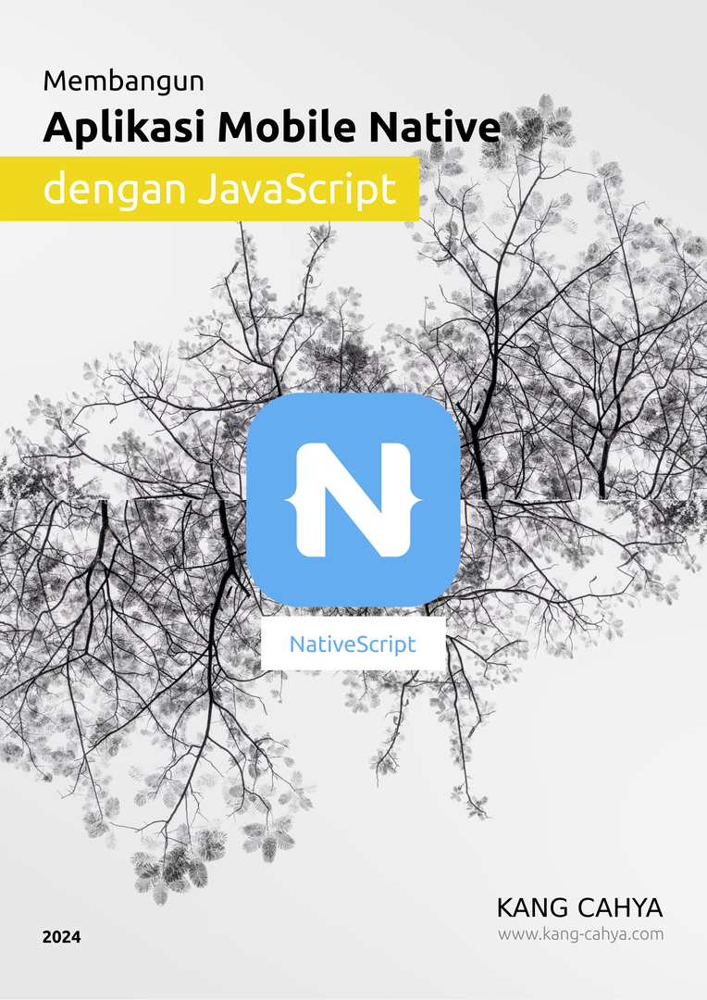

# Nativescript Book ID
> Buku "Nativescript by Javascript" dalam bahasa Indonesia.

NativeScript adalah sebuah framework yang memungkinkan Anda membangun aplikasi seluler untuk platform Android dan iOS. Terbaru, NativeScript juga mendukung pengembangan aplikasi untuk platform macOS dan VisionOS hanya dengan menggunakan JavaScript.

## KATA PENGANTAR

Puji syukur saya panjatkan kepada Tuhan Yang Maha Esa atas segala rahmat dan karunia-Nya, sehingga saya dapat menyelesaikan buku ini yang berjudul *“NativeScript: Membangun Aplikasi Mobile dengan JavaScript”*. Buku ini disusun dengan harapan dapat menjadi panduan bagi para pengembang web yang ingin mengeksplorasi dunia pengembangan aplikasi Mobile dengan menggunakan teknologi hibrid dari NativeScript.

Dalam proses penulisan buku ini, saya menyadari bahwa perjalanan ini tidaklah mudah. Banyak tantangan dan hambatan yang harus dihadapi, namun berkat dukungan dari berbagai pihak, saya dapat menyelesaikannya dengan baik.

Pertama-tama, saya ingin mengucapkan terima kasih yang sebesar-besarnya kepada istri saya tercinta, yang selalu memberikan dukungan, cinta, dan motivasi tanpa henti. Tanpa dukungan moral dan semangat dari istri saya, mungkin buku ini tidak akan pernah terwujud. Keberhasilannya adalah hasil dari pengorbanan dan kasih sayang yang diberikan kepada saya sepanjang proses ini.

Selanjutnya, saya ingin menyampaikan rasa terima kasih yang tulus kepada guru saya di SMK 2 Kuningan, Bapak Oya Suryana, S.E., M.Kom. Bapak telah memberikan ilmu, inspirasi, dan bimbingan yang sangat berarti selama saya menempuh pendidikan. Saya tidak akan pernah melupakan jasa-jasa Bapak yang telah memberikan dorongan untuk terus belajar dan berkembang.

Akhir kata, saya berharap buku ini dapat memberikan manfaat dan wawasan baru bagi para pembaca, khususnya dalam mengembangkan aplikasi Mobile menggunakan NativeScript. Saya juga terbuka terhadap kritik dan saran yang konstruktif untuk perbaikan di masa mendatang.

Selamat membaca, dan semoga buku ini dapat membantu Anda dalam mengeksplorasi dunia pengembangan aplikasi Mobile.

## DAFTAR ISI

1. **BAB I : NATIVESCRIPT**
   1. Tentang
   1. Rasa (Flavor)
   1. Runtime
      1. VisionOS
      1. Android
      1. IOS
   1. Perkembangan Teknologi
      1. WebView Apps
      1. Hybrid Apps
      1. Native Apps
   1. Posisi Nativescript
   1. Nativescript vs React Native
   1. Kenapa Harus Nativescript
   1. Komunitas
   1. Adopsi Industri
   1. Ringkasan
1. **BAB II : PANDUAN AWAL DAN KONTEKS PENGEMBANGAN**
   1. Target Pembaca
   1. Bahasa Pemrograman yang Digunakan
   1. Perangkat yang Direkomendasikan
   1. Platform Pengembangan
   1. Demo Aplikasi
1. **BAB III : PERSIAPAN AWAL SEBELUM MEMULAI**
   1. Environment Setup
      1. Java Development Kit (JDK)
      1. Android Software Development Kit (SDK)
   1. Tools Setup
      1. Node.js
      1. Nativescript CLI
   1. Verifikasi Environment
   1. Ringkasan
1. **BAB IV : MEMULAI MEMBUAT PROYEK BARU**
   1. Nativescript CLI
   1. Proyek Baru
   1. Nativescript Preview
   1. Nativescript Plugin
      1. Official Plugin
      1. Community Plugin
   1. Show Case
   1. Snack
1. **BAB V : KONSEP DASAR**
   1. Struktur Folder
   1. Style Sheets
   1. Binding Data
      1. Observable
      1. Observable Array
   1. API yang umum Digunakan
      1. Application
      1. ApplicationSettings
      1. Connectivity
      1. Device
      1. FileSystem
      1. HTTP
      1. ImageCache
      1. Utils
   1. Gestur
   1. Debuging
1. **BAB VI : KOMPONEN UI**
   1. Navigation Components
      1. Page
      1. Action Bar
      1. Frame
   1. Layout Components
      1. Absolute Layout
      1. Wrap Layout
      1. Flexbox Layout
      1. Grid Layout
      1. Stack Layout
   1. Basic Components
      1. Activity Indikator
      1. Button
      1. Date dan Time Picker
      1. HTML View
      1. Image
      1. Label
      1. ListView
      1. Progress
      1. Scroll View
      1. Search Bar
      1. Segmented Bar
      1. Slider
      1. Switch
      1. Tab View
      1. Text Field
      1. Text View
      1. Web View
   1. Dialogs
      1. Alert
      1. Action
      1. Confirm
      1. Prompt
      1. Login
1. **BAB VII : KONSEP TINGKAT LANJUT**
   1. Kode Native
   1. Styling
   1. Best Practices
      1. View Bindings
      1. Template di dalam ListView
      1. Hidden dan Visibility Konten
      1. Delaying dengan Timers
      1. Optimasi Gambar
   1. Font Icon
      1. FontAwesome
      1. Material Symbols
1. **BAB VIII : MERILIS APLIKASI**
   1. Konfigurasi
      1. Application ID
      1. Application Name
      1. Launch Icon
      1. Launch Screen
      1. Minimum SDK dan Target SDK
   1. Keystore
      1. Fungsi Keystore
      1. Membuat Keystore
   1. Build Aplikasi
      1. Format Output
      1. Flag dan Perintah Build
   1. Ringkasan
1. **BAB IX : MEMONETISASI APLIKASI**
   1. AdMob
      1. Banner Ad
      1. Interstitial Ad
      1. Native Ad
      1. Rewarded Ad
   1. Implementasi AdMob
      1. Persiapan
      1. Pemasangan dan Konfigurasi Plugin
      1. Menyematkan Iklan dari Google AdMob
   1. Ringkasan

## DAFTAR PUSTAKA

Wikipedia. (n.d.). *NativeScript*. Diakses pada 1 Juli 2024, dari <https://en.wikipedia.org/wiki/NativeScript>

Wikipedia. (n.d.). *Mobile app*. Diakses pada 1 Juli 2024, dari <https://en.wikipedia.org/wiki/Mobile_app>

Wikipedia. (n.d.). *SAP SE*. Diakses pada 5 Juli 2024, dari <https://id.wikipedia.org/wiki/SAP_SE>

Wikipedia. (n.d.). *React Native*. Diakses pada 9 Juli 2024, dari <https://en.wikipedia.org/wiki/React_Native>

NativeScript. (n.d.). *NativeScript*. Diakses pada 19 Juli 2024, dari <https://nativescript.org>

NativeScript. (n.d.). *Panduan Dasar CLI NativeScript*. Diakses pada 15 Juli 2024, dari <https://docs.nativescript.org/guide/cli-basics>

NativeScript. (n.d.). *Panduan Debugging di NativeScript*. Diakses pada 15 Juli 2024, dari <https://docs.nativescript.org/guide/debugging>

NativeScript. (n.d.). *Plugin Rekomendasi di NativeScript*. Diakses pada 2 Agustus 2024, dari <https://docs.nativescript.org/recommended-plugins>

NativeScript. (n.d.). *Best Practices di NativeScript*. Diakses pada 4 Agustus 2024, dari <https://docs.nativescript.org/best-practices/>

NativeScript. (n.d.). *Panduan Plugin NativeScript*. Diakses pada 4 Agustus 2024, dari <https://docs.nativescript.org/plugins/>

NativeScript. (n.d.). *Panduan UI NativeScript*. Diakses pada 7 Agustus 2024, dari <https://docs.nativescript.org/ui/>

NativeScript. (n.d.). *API Dokumentasi NativeScript*. Diakses pada 7 Agustus 2024, dari <https://docs.nativescript.org/api/>

Apple Inc. (n.d.). *VisionOS*. Diakses pada 14 Agustus 2024, dari <https://developer.apple.com/visionos/>

Apple Inc. (n.d.). *Dokumentasi JavaScriptCore*. Diakses pada 15 Agustus 2024, dari <https://developer.apple.com/documentation/javascriptcore>

React Native. (n.d.). *Fast Refresh di React Native*. Diakses pada 15 Agustus 2024, dari <https://reactnative.dev/docs/fast-refresh>

SAP SE. (n.d.). *SAPUI5*. Diakses pada 15 Agustus 2024, dari <https://sapui5.hana.ondemand.com/>

SAP SE. (n.d.). *NativeScript Framework Modules (MDK Advanced)*. Diakses pada 15 Agustus 2024, dari <https://help.sap.com/doc/f53c64b93e5140918d676b927a3cd65b/Cloud/en-US/docs-en/guides/getting-started/mdk/advanced/nativescript-framework-modules.html>

NewbieScripterRepo. (n.d.). *PoolPartyFM*. GitHub. Diakses pada 20 Agustus 2024, dari <https://github.com/NewbieScripterRepo/PoolPartyFM>

Google LLC. (n.d.). *ExoPlayer*. GitHub. Diakses pada 20 Agustus 2024, dari <https://github.com/google/ExoPlayer>

## Demo Aplikasi
Untuk aplikasi demo dapat di unduh langsung lewat [Google Play Store](https://play.google.com/store/apps/details?id=com.kang.cahya.apps.sampleDemoOfNativescriptBook)

## Penulis

Kang Cahya

[Github](https://github.com/dyazincahya) | [www.kang-cahya.com](http://www.kang-cahya.com) | [Google Play Store](https://play.google.com/store/apps/dev?id=8941046243892038548)
